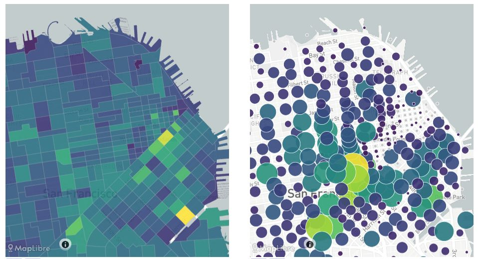

_(1) Area map with "choropleth" color-filled areas; (2) Area map with circles instead of filled areas_

### Aggregate 'choropleth' and dot-size maps

Area maps with filled colors are excellent for depicting spatial data in one dimension.

Note that very large and very small areas on the same maps can create misleading visualizations; in this case it may be best to normalize data by area before plotting it. Alternatively, the circle-plots show exactly the same data in a different manner.

**NOTE** Both plots are created using the same configuration below. Click the UI button below the maps to switch between the two views.

## Usage

Area maps can only be included as panels in **Dashboards**. See Dashboard documentation for general tips on creating dashboard configurations.

- Each area map panel is defined inside a **row** in a `dashboard-*.yaml` file.
- Use panel type `map` in the dashboard configuration. (Note this may change in the future as we add more map types)
- Standard title, description, and width fields define the frame.
- **BOUNDARIES** must be in GeoJSON format, and must use latitude/longitude (EPSG:4326) coordinates. You can use QGis, R, Python to convert shapefiles to GeoJSON format.

---

### Sample dashboard.yaml config snippet with a heatmap

```yaml
layout:
  trips:
    - title: "Trip Destinations"
      description: "All day"
      type: "map"
      width: 2
      height: 10
      props:
        dataset: "data/trip-destinations.csv"
        datasetValue: "tour_id"
        datasetJoinCol: "dtaz"
        boundaries: "boundaries/TAZ/sftaz.geojson"
        boundariesJoinCol: "TAZ"
        boundariesLabels: "SFTAZ"
        exponentColors: true

    - title: "Zero-Car Households"
      description: "Absolute number of 0-car households"
      type: "map"
      width: 1
      height: 8
      props:
        dataset: "data/hh-by-autos-taz.csv"
        datasetValue: "zeroHHs"
        datasetJoinCol: "hhtaz"
        boundaries: "boundaries/TAZ/sftaz.geojson"
        boundariesJoinCol: "TAZ"
        boundariesLabels: "SFTAZ"
```

---

### Area Map properties

Area map properties belong in the `props` section:

Note there are two separate data files loaded for each area map: one for the boundaries, and one for the dataset.

Each data file must contain a column identifying the aggregation area, in order to join the two datasets together. In other words, the boundary IDs must be present (somwhere) in both datafiles. The names of the columns can be different in the two files; see below.

**dataset:** String. The filepath containing the data. May include wildcards \* and ?.

**datasetValue:** Name of the column in the dataset that contains the data to be plotted. Data will be aggregated (summed).

**datasetJoinCol:** Name of the column containing the shapefile boundary IDs; e.g. the TAZ numbers or neighborhood group IDs.

**boundaries:** A GeoJSON file containing the geometries for the boundaries.

- There must be a property containing an ID for each boundary.
- Coordinates MUST be in longitude/latitude (EPSG:4326) format. Do any necessary conversions before you load the data. Use QGis, R, Python, etc to do the conversions.

**boundariesJoinCol:** The name of the column (or property) containing the ID for each subarea.

**boundariesLabels:** The name of the column containing labels for each area, if it exists. The ID itself will be displayed if no labels are specified.

**exponentColors:** Optional true/false. If true, values will be scaled exponentially before being drawn. This is often useful if values are concentrated in small areas, and much higher in value than in typical areas.
