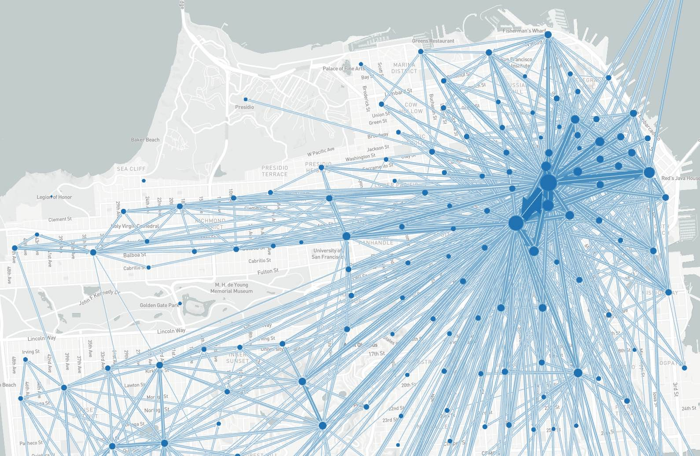

_A flow map of San Francisco_

Flowmaps depict _aggregate movements_ between origins and destinations.

**THIS VIEW IS UNDER CONSTRUCTION, MORE TO COME...**

## Usage

Flow maps can be included as panels in **Dashboards** or used as a **standalone map**. See [Dashboard documentation](dashboards) for general tips on creating dashboard configurations.

**Standalone:** Create a `viz-flowmap*.yaml` file as described below

 -or-
 
 **Embed in Dashboard:** `Create a dashboard-*.yaml` file and include a `type:flowmap` section as desccribed below.
- Each chart panel is defined inside a **row** in a `dashboard-*.yaml` file.
- Standard title, description, height, and width fields define the frame.

---

### Configuration reference properties

NOTE: These properties all go into a `viz-flowmap*.yaml` file as-is, or in a dashboard file they all go under the `props:` section of a layout row. See the examples at the end of this document.

- **title:** (optional) title of the visualization, appears right on top of the map. In the case of a dashboard: if a title is specified both under `general` and under `props`, the one under `general` will be used.

- **description:** (optional) description of the visualization, appears between title and map. In the case of a dashboard: if a description is specified both under `general` and under `props`, the one under `general` will be used.

- **boundaries:** Geojson file with feature element boundaries.

- **boundariesJoinCol:** The property in the boundary file containing the feature ID

- **boundariesLabels:** The human readable name for the boundary ID column

- **dataset:** CSV file containing at least three columns: origin, destination, and flow.

- **origin:** The column name containing origin IDs

- **destination:** The column name containing destination IDs

- **flow:** The column name containing flow values

- **center:** (optional) coordinates that the map centers on. Can be provided as array or string. If it is not provided, a center is calculated using a sample of the data.

- **zoom:** (optional) zoom level of the map between 5 and 20. If it is not provided, the zoom level 9 is used.

- **pitch:** (optional) If it is not provided, the pitch is 0.

- **bearing:** (optional) If it is not provided, the bearing is 0.
- **locationLabelsEnabled:** `true` or `false`. Turns the location labels on and off.
- **labelsEnabled:** ???
- **darkMode:** ??? `dark` and `false`, switches between different colour modes. `true` and `dark` both activate dark mode.
- **clusteringAuto:** (optional) `true`or `false`. Turns the automatic scaling of the clustering on and off. If turned off, a value for **clusteringLevel** should be provided. The standard value used is `true`.
- **clusteringLevel:** (optional) The aggregation level of the flows. Relevant if **clusteringAuto** is `false`.
- **clusteringEnabled:** (optional) `true` or `false`. Turns the aggregation of the flows on and off. The standard value used is `true`.
- **animationEnabled:** `true` or `false`. Turns the animation of the flows on and off.
- **pickable:** `true` or `false`. When `true`, hovering over a flow highlights it.
- **opacity:** value between `0` and `1`, describes the opacity of the flows.
- **adaptiveScalesEnabled:** ???
- **outlineThickness:** ??? nothing seems to change when changing this value, extremely large values crash it
- **showOnlyTopFlows:**??? nothing seems to change


---

### Sample dashboard.yaml config snippet

```yaml
layout:
  row1:
    - type: "flowmap"
      title: "Origin/Destination Flows"
      description: "Total daily trips"
      width: 2
      props:
        boundaries: "taz.geojson"
        boundariesJoinCol: "TAZ1454"
        boundariesLabels: "TAZ"
        dataset: "trip-od-flows.csv"
        origin: "origin"
        destination: "destination"
        flow: "trips"
```

