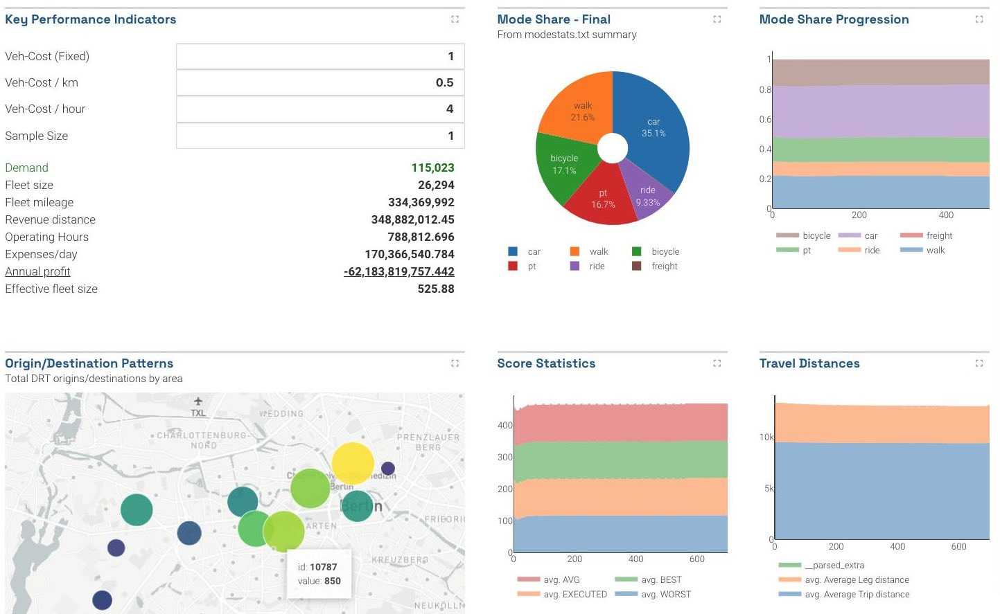

A dashboard is a page laid out with multiple charts, plots, and visualizations all together. You define the layout with a YAML configuration file which contains the types of plots and their configurations all in one place.


_Dashboards usually show several at-a-glance summary metrics._

## Defining dashboards with dashboard-*.yml files

A folder can contain any number of YAML configuration files named `dashboard-*.yml`. If these config files exist, SimWrapper will automatically generate and display the dashboards instead of the usual folder browser view.

When multiple dashboard YAML files exist in a folder, each will be shown as a navigation tab at the top of the page.

Start with the example below and edit as necessary. YAML is _extremely picky_ about white space and indentation, like Python. Be careful!

## Dashboard Header

A dashboard config requires a top-level `header` containing _tab_ and _title_ and some optional fields.

```yaml
header:
  tab: 'Summary'
  title: 'Top-Level Summary Statistics'
  description: 'At-a-glance figures we usually look at' #optional
  triggerPattern: "*.drt.csv" #optional
```

|**Field**|**Description**|**Default**|
|-------|---------|-------------|
|title|Header title displayed at top of dashboard|--|
|tab|Name shown on the tab|Same as title|
|description|Longer text shown below dashboard title|--|
|triggerPattern|If specified, the dashboard defined in this YAML will only be generated when a filename matching the given triggerPattern exists in the current folder. For example, if it is set to `triggerPattern: "*.drt.csv"` and the file `output_mode.drt.csv` exists in the current folder, then this dashboard will be created. If no file matches the given pattern, then this dashboard will be skipped. If triggerPattern is not specified, then the dashboard will always be generated.|--|

## Dashboard Layout

Below the header, a dashboard also requires a `layout` section which defines a set of named **rows**. The row names themselves are not displayed anywhere; they are just there to help you organize the file.

#### Rows

Each `row` can contain either (1) the properties of a full-width panel, or (2) a YAML **list** of properties for panels that will be laid out horizontally in the row. YAML lists have a strange syntax with `-` hyphens marking the beginning of a list item. It's best to just look at the example below.

By default, multiple panels are laid out from left to right, in equal widths. (But see _width_ option further below)

```yaml
layout:
  myRow1: # this row has one full-width chart
    type: bar
    title: 'My Bar Chart'
    dataset: mycsvdata.csv
    # ...

  # next row has two charts, using the '-' YAML list syntax
  myMultiRow:
    - type: bar
      title: 'My Bar Chart'
      dataset: mycsvdata.csv
      # ...

    - type: table
      title: 'My Summary Table'
      config: summary-table.yaml
```

That indentation in the example above is extremely important! Indentation is how YAML interprets the grouping of elements.

#### Chart/plot details

Each element in a row has the following properties. This defines both the how the panel will be featured in the dashboard, as well as the panel-specific properties themselves.

|**Field**|**Description**|**Default**|
|-------|----------|-------------|
|type| (required) The chart or plot type, e.g. `pie`, `bar`, `map`, etc. See the individual chart docs on the left-nav for all available plots.||
|title|The name of the plot||
|description|A brief description, displayed below the title||
|height|Set the panel height here, 5 is default and larger numbers make taller panels | 5 |
|width|Set _relative widths_ of panels sharing space on the same row by specifying the width of each panel here. Panels have a default width of 1, and total row width is additive. For example in a row with 3 panels, if the width of the first panel is set to 2, then [2+1+1] is four, thus the first panel fills 50% of the row, and the remaining two fill 25% each. | 1 |
|_Other properties_|Every panel type has its own set of properties. Include those as `key: value` lines in the configuration, as needed. See the individual chart docs in the API Reference.<br/> _The chart type determines the set of valid properties!_||

## Full example: dashboard-summary.yaml

Here is a full example dashboard, pulling all of the above together. Especially note the whitespace/indentation and the use of `-` to denote YAML lists.

**dashboard-summary.yaml**
```yaml
header:
  tab: "Summary"
  title: "My Summary Dashboard"
  description: "Examples of various chart types"

layout:
  row1: # this row has two charts
    - type: pie
      width: 1 # this pie will be 1/3 of the row width
      title: "Mode Share - Final"
      description: "From modestats.txt summary"
      dataset: "*modestats.txt"
      useLastRow: true
      ignoreColumns: ["Iteration"]

    - type: bar
      width: 2 # this barchart will be 2/3 of the row width
      title: "Example Bar Plot"
      description: "Distance over Iteration"
      columns: [distance_mean, directDistance_mean]
      legendName: [Mean Distance, Mean Direct Distance]
      skipFirstRow: true
      dataset: "*drt_customer_stats_drt_short.csv"
      x: "iteration"
      yAxisName: "Distanz"
      xAxisName: "Iteration"

  secondRow: # this row has just one plot
    type: "line"
    title: "Example Line Plot"
    description: "Distance over Iteration"
    columns: [distance_mean, directDistance_mean]
    legendName: [Mean Distance, Mean Direct Distance]
    skipFirstRow: false
    dataset: "*drt_customer_stats_drt.csv"
    x: "iteration"
    yAxisName: "Distance"
    xAxisName: "Iteration"
```
