The thumbnails below depict each visualization type that is available in SimWrapper. Click on a thumbnail for the detailed guide on parameters and an explanation of how to include that visualization in your analysis or dashboard.

For general help on getting started with SimWrapper, see the [Getting Started Guide](guide-getting-started).

---

## MATSim visualizations

These visualizations are for MATSim-specific outputs.

#### MATSim Carriers/Freight
[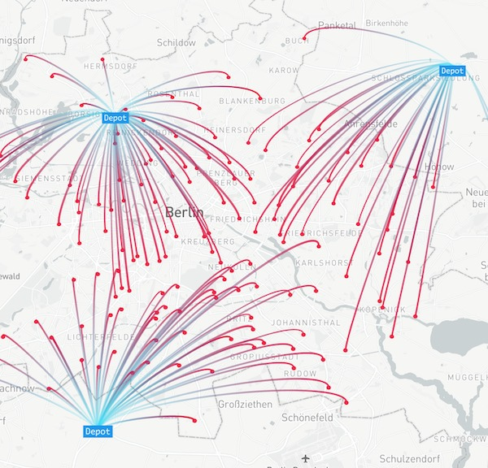](matsim-carrier-viewer.md)

<!--   -----------------------   -->

#### MATSim vehicle animation (DRT)
[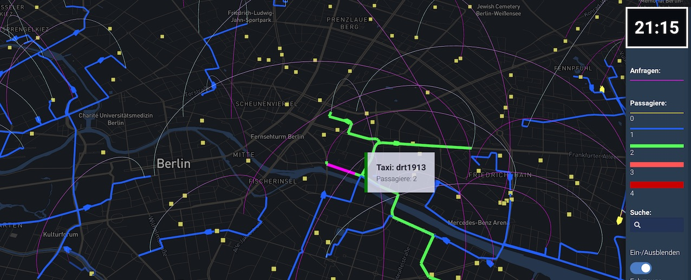](matsim-drt-animation.md)

<!--   -----------------------   -->

#### MATSim network link&nbsp;plots

<!--   -----------------------   -->

#### MATSim transit network
[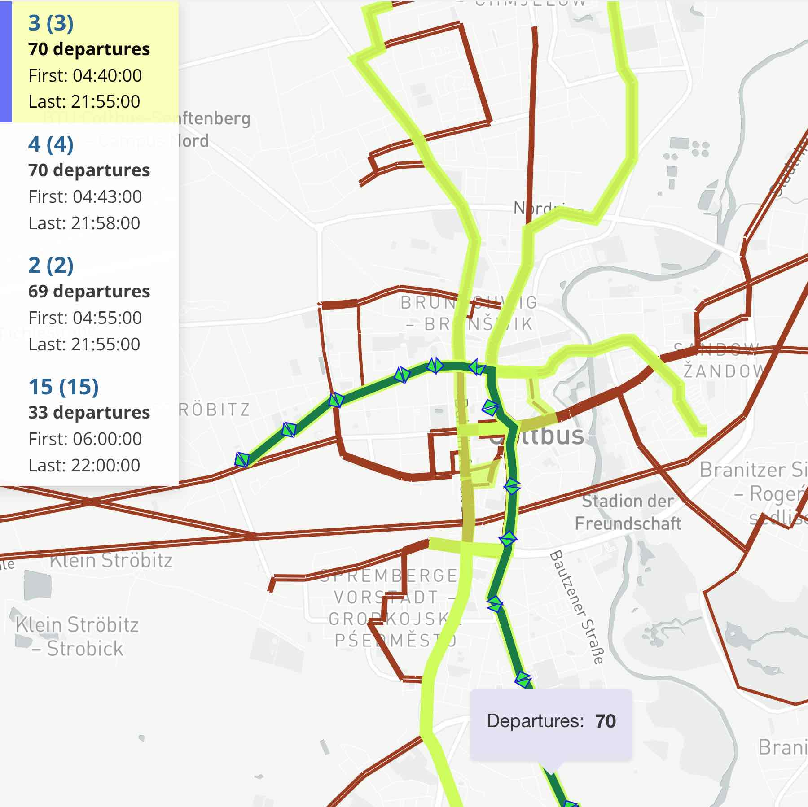](matsim-transit-supply.md)

<!--   -----------------------   -->

#### MATSim Event viewer (experimental)
[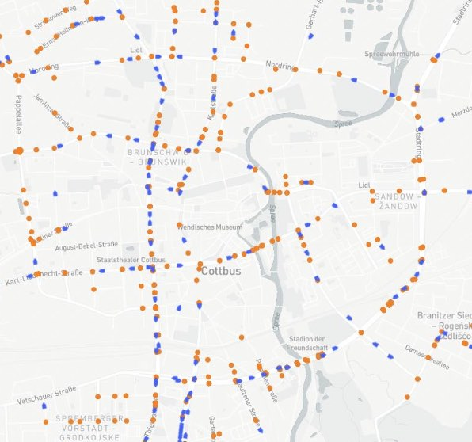](matsim-events.md)

<!--   -----------------------   -->

---

## Statistical charts and maps

These visualizations work with any dataset, generally using CSV text format or XML files.

#### Aggregate O/D flow
[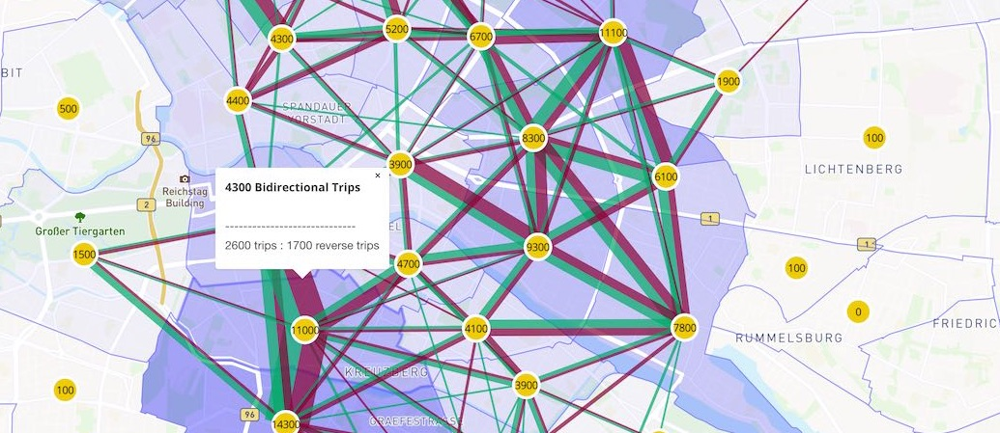](ref-aggregate-od.md)

<!--   -----------------------   -->

#### Bar, area, line charts
[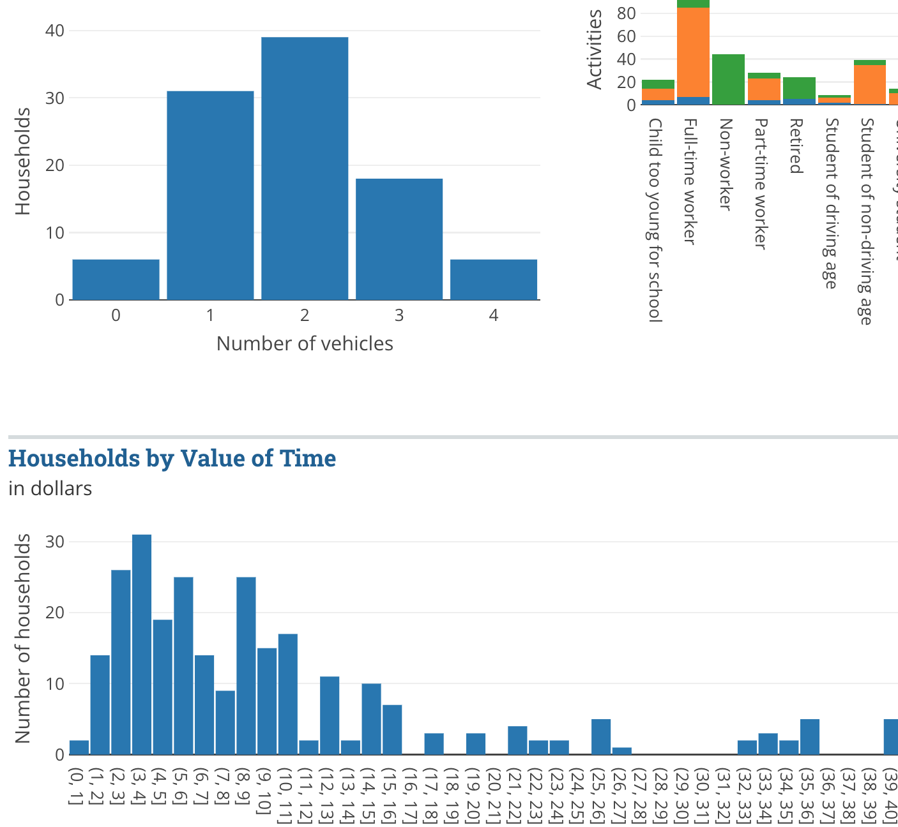](ref-bar-area-line.md)

<!--   -----------------------   -->

#### Calculation table
[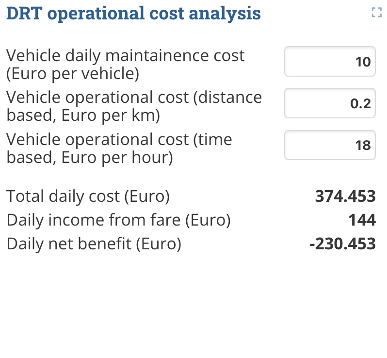](ref-topsheet-table.md)

<!--   -----------------------   -->

#### Flow map

<!--   -----------------------   -->

#### Heat map plot

<!--   -----------------------   -->

#### Pie charts
[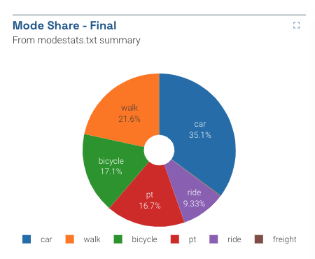](ref-pie-charts.md)

<!--   -----------------------   -->

#### Plotly chart
[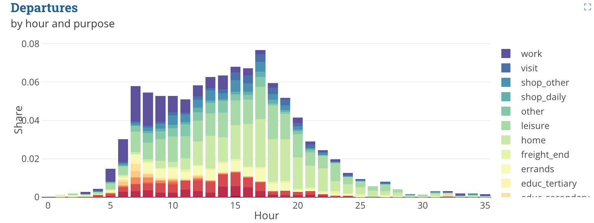](ref-plotly.md)

<!--   -----------------------   -->

#### Sankey flow diagram
[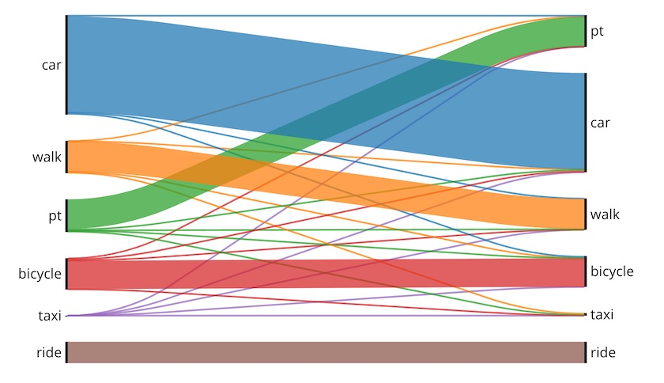](ref-sankey.md)

<!--   -----------------------   -->

#### Scatter plots
[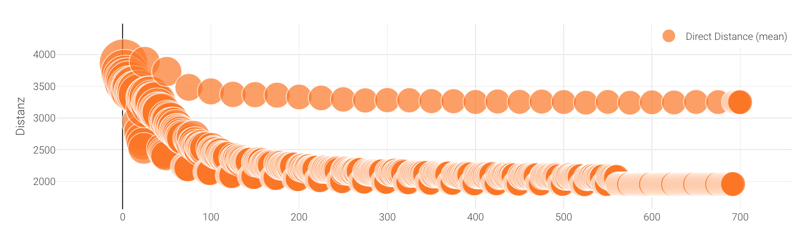](ref-xy-scatter-plots.md)

<!--   -----------------------   -->

#### Shapefiles: area
[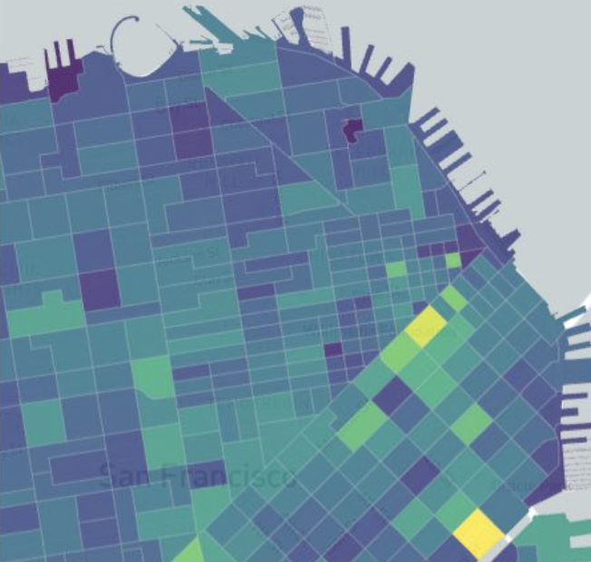](ref-shapefiles.md)

<!--   -----------------------   -->

#### Shapefiles: networks

<!--   -----------------------   -->

#### Text/Markdown
[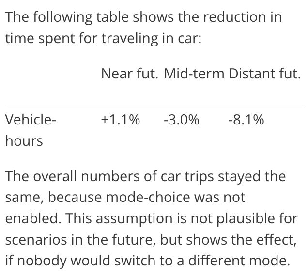](ref-text-block.md)

<!--   -----------------------   -->

#### Tiles: single metrics
[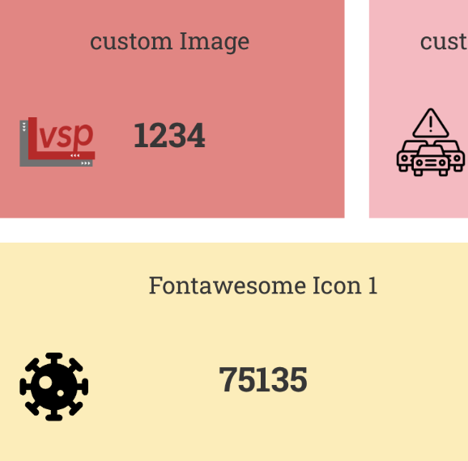](ref-tiles.md)

<!--   -----------------------   -->

#### Vega-lite charts
[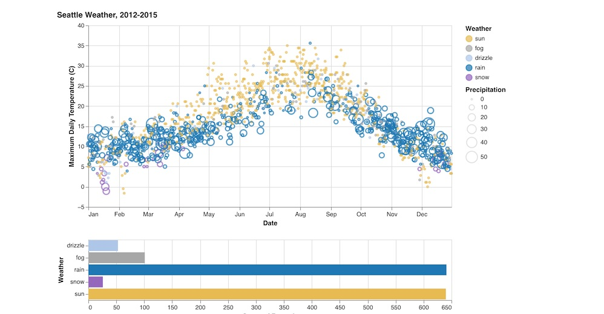](ref-vega-lite.md)

<!--   -----------------------   -->

#### Video player
[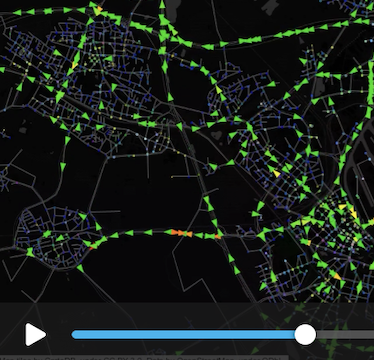](ref-video-player.md)

<!--   -----------------------   -->

#### XML Config viewer
[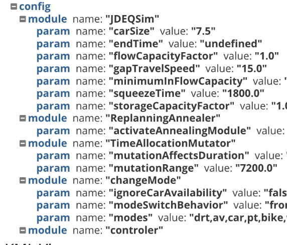](ref-xml-viewer.md)

<!--   -----------------------   -->

#### X/Y hexagons
[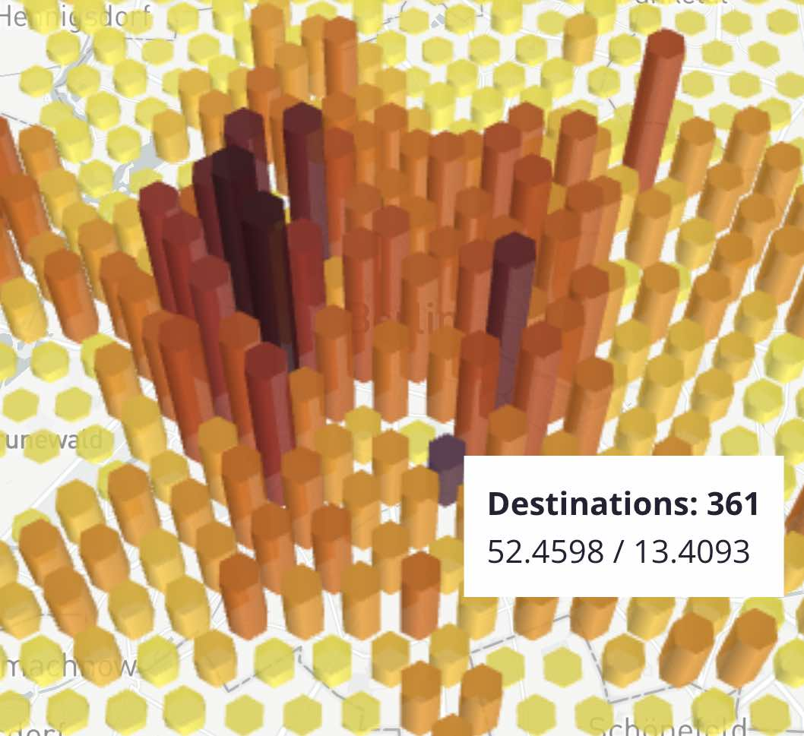](ref-xy-hexagons.md)

<!--   -----------------------   -->

#### X/Y/Time point data
[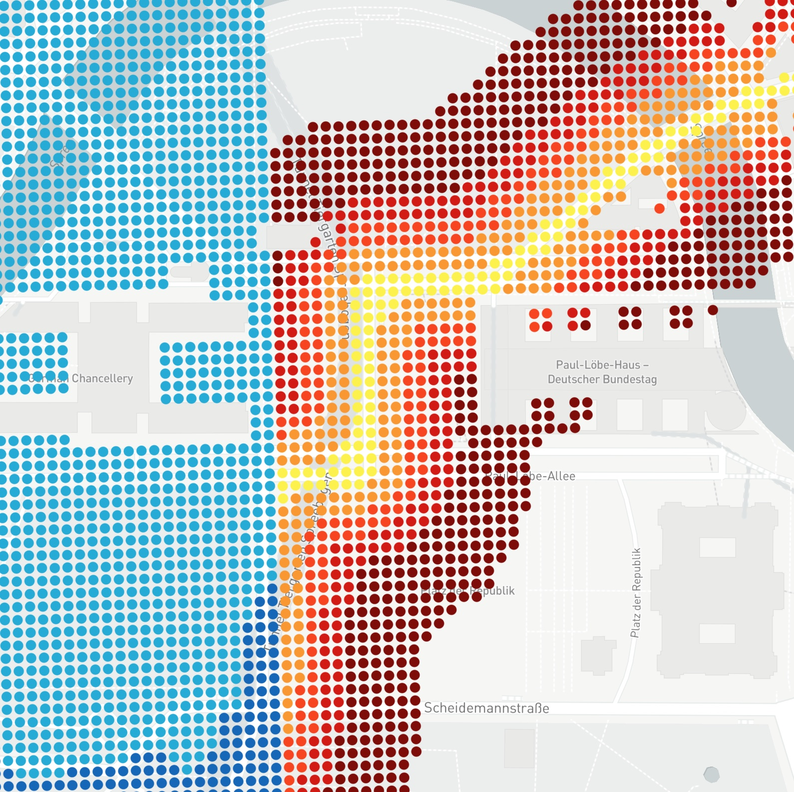](ref-xy-time.md)

