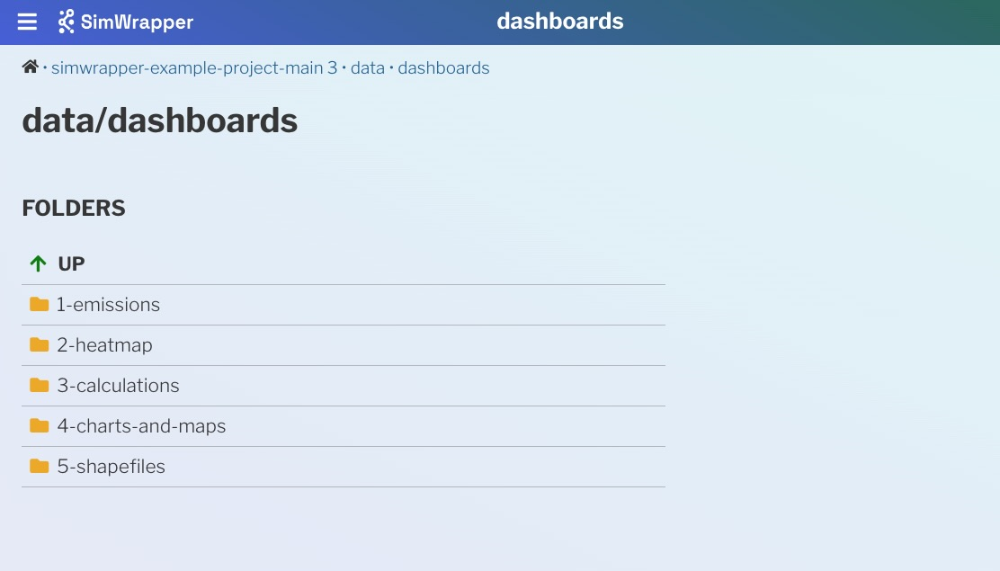

Welcome to SimWrapper! Let's get you up and running with the basics.

- This guide uses sample data that's hopefully a lot like the data you would have for your projects
- Use Google Chrome or MS Edge for the guide. Other browsers (Firefox, Safari) require a [separate local HTTP server](file-management) to access local files; for now that's just a stumbling block to getting started.

## How it works: SimWrapper and file-based configuration

Most MATSim/ActivitySim outputs such as the `*.xml.gz` files are too large to open in a web browser, so SimWrapper provides a set of _visualization plugins_ which can display something useful for you. Plugins exist for lots of things and the list is growing: link volumes, agent animations, aggregate area summaries, and more.

Here's how it works: For every visualization you want to create, you write a small _configuration file_ and store it in the same folder as the inputs for that visualization. We use the YAML text format, which is a common configuration file format. For each properly named YAML file, one visualization thumbnail will appear in that folder when you navigate to the folder in SimWrapper. Clicking on the thumbnail will open that visualization full-screen.

Generally, a viz will require a specific set of inputs, and those inputs are usually the result of some _post-processing_ of the raw simulation outputs. It's up to you to do that post-processing and store the files in the same folder as your config file.

Let's get started with some sample data.

## 1. Get the sample data and open it in SimWrapper

- Download [simwrapper-example-project.zip](https://github.com/simwrapper/simwrapper-example-project/archive/refs/heads/main.zip) from GitHub
- Unzip the file somewhere you can find it easily - Desktop, home folder, etc.
- Go to [simwrapper.github.io](https://simwrapper.github.io/site) and click `Add folder...` and browse to the folder you just created. Grant access to the folder so the SimWrapper site can see the files!
  - (If you are using Firefox, `cd` to the data folder and run `simwrapper here` to start the local HTTP server)

You should now see something similar to this:

<i>Example data folder</i></img>

## 2. Explore the samples

Each of the subfolders in the example project shows different map views and capabilities of SimWrapper -- network link plots, statistical charts, area maps (shapefiles), dashboards, and so on.

- Experiment with the various knobs and configuration settings to see how the visualizations can be manipulated
- From your PC file browser, open up the `viz-*.yaml` files in each subfolder to see how each of the visualizations is defined in a readable text format.
- Every visualization type has a different filename "prefix" to help you find them: e.g, `viz-map-*.yaml` are for shapefiles, `viz-link-*.yaml` are for MATSim network plots, and so on.
- You can edit these YAML files, save, and click Reload on your browser to see how your changes affect the visualizations.

## 3. Create a dashboard with some charts

The dashboards subfolder shows how you can combine multiple visualizations into cohesive dashboards.

- The `dashboard-*.yaml` files define each individual tab in a dashboard. It's often nice to name them `dashboard-1-*.yaml`, `dashboard-2-*.yaml` etc, to set them in the order that you like.
- Dashboards are laid out in rows: Each row can have multiple panels. See the YAML files for how this works!

See the [Dashboards in Depth](guide-dashboards) article to learn more about building multi-panel dashboards.

## 4. Configuring dashboard templates for multiple run folders

In SimWrapper, everything is folder-based. So `viz-*.yaml` and `dashboard-*.yaml` files in a folder will automatically be detected and loaded based on their filenames.

If you want to define dashboards that will be used for **multiple folders**, such as several runs for a particular project:

- **Create a folder** named `simwrapper` in the parent project directory.
- Move all dashboard, viz, and template YAMLs into that folder
- Tweak any file paths as necessary, so that relative file names resolve properly.
- The base folder for a dashboard is the _folder you are viewing_, not the dashboard template folder.
- You can have multiple `simwrapper` folders all the way up your folder hierarchy; dashboard panels will be generated based on filename, and each found dashboard will be displayed as a tab on the folder view.

## 5. More details on visualizations and their YAML files

Here is an example YAML config file for a link-volume summary:

**viz-links-example.yaml:**

```yaml
title: 'Taxi Passengers'
description: 'Hourly passenger pickups'
csvFile: 'vol_passengers.csv'
geojsonFile: '../road-network.json.gz'
projection: 'EPSG:25832'
sampleRate: 0.10
```

This config names two files, a CSV of link volumes and a zipped JSON file of the MATSim road network, and some parameters needed for the viz to work. Those files are outputs of some post-processing scripts described in the plugin docs.

If you wanted to look at several different link volume plots from the same model run, (e.g. for vehicle counts instead of passengers), you would make a copy of this file, give it a different name, and edit the `csvFile` parameter to point to the correct CSV.

This is a very different paradigm than most "point and click" GIS tools, but we have found that the ability to script and cut/paste the config files has been a huge time saver and also reduces manual errors.

> Make sure that your files are allowed to be "world-readable" before you publish anything to public-svn! Once files are pushed to public-svn, they are not secured in any way; anyone on the internet can access them!

### Visualization types

Each visualization is described in the API Reference section of this documentation, including how to post-process your outputs if necessary, and how to define any configuration settings for your visualizations.

