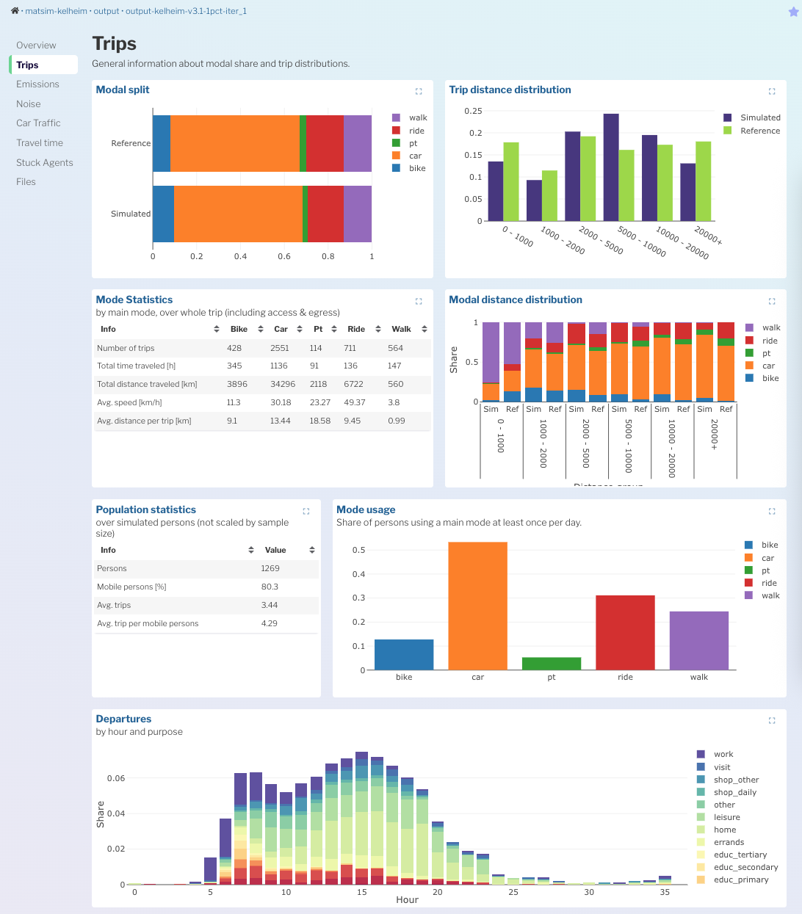

MATSim users should take advantage of the [MATSim SimWrapper Contrib](https://github.com/matsim-org/matsim-libs/tree/main/contribs/simwrapper) which makes building SimWrapper dashboards very easy.

Including the simwrapper contrib allows you to write Java code directly in your simulation that builds dashboards for you -- in most cases you don't need to write any YAML at all.

By adding a single line to your MATSim project config, you will get a _default SimWrapper dashboard_ that gets built automatically when you run your simulation. From there, you can add further project-specific dashboards as needed.

## Including the SimWrapper contrib

First, make sure the simwrapper contrib is included and activated in your project `pom.xml`:

```xml
<dependencies>
  <!-- ... -->
    <dependency>
			<groupId>org.matsim.contrib</groupId>
			<artifactId>simwrapper</artifactId>
			<version>${matsim.version}</version>
    </dependency>
</dependencies>
```

Then, in your run class, add this one line wherever you add your other project modules:

```java
controler.addOverridingModule(new SimWrapperModule())
```

That's it. When you run your simulation, the contrib will automatically generate the necessary `dashboard-*.yaml` files in your output folder.<br/>Open [simwrapper.app](https://simwrapper.app), open your local output folder, and the dashboards should be there.



## Creating your own dashboards from code

Now that you have the default dashboard working, you can start adding your own dashboards.

There are fully-executed examples in the following open scenarios:

- https://github.com/matsim-scenarios/matsim-berlin
- https://github.com/matsim-scenarios/matsim-leipzig

Explore the files in `src/main/java/org/matsim/dashboard` for examples on creating post-processed CSV outputs and the dashboard configurations.
- In particular this example dashboard is very feature-rich: https://github.com/matsim-scenarios/matsim-leipzig/blob/main/src/main/java/org/matsim/dashboard/CycleHighwayDashboard.java

### IntelliJ autocomplete

While writing your dashboard code, take advantage of IntelliJ's autocomplete feature. At each step of writing the code below, pressing `Tab` after any of the dots will drop down an autocomplete with all of the YAML parameters available on that object. This is far less error-prone than trying to decipher the YAML configuration options from the SimWrapper documentation itself.

The SimWrapper docs are the primary source of truth, however. If you find discrepancies between what IntelliJ thinks and what the SimWrapper docs say, try both and report back to us if there are problems!

**Example dashboard-building Java code:**
```java
Config config = ConfigUtils.createConfig();

SimWrapper sw = SimWrapper.create(config);

SimWrapperConfigGroup simwrapperCfg = ConfigUtils.addOrGetModule(config, SimWrapperConfigGroup.class);
simwrapperCfg.defaultDashboards = SimWrapperConfigGroup.Mode.disabled;
simwrapperCfg.sampleSize = 0.25;
simwrapperCfg.defaultParams().mapCenter = "12.38,51.34";
simwrapperCfg.defaultParams().mapZoomLevel = 6.8;

//skip default dashboards
simwrapperCfg.defaultDashboards = SimWrapperConfigGroup.Mode.disabled;

//add dashboards according to command line parameters
if (cycleHighwayAnalysis == CycleHighwayAnalysis.ENABLED) {
  sw.addDashboard(Dashboard.customize(new CycleHighwayDashboard(baseDir, shp.getShapeFile(), highwaysShpPath)).context("cycle-highway"));
}

try {
  sw.generate(runDirectory);
  sw.run(runDirectory);
} catch (IOException e) {
  throw new InterruptedIOException();
}
```

**Snippet from CycleHighwayDashboard.java:**
```java
package org.matsim.dashboard;

import org.matsim.analysis.CycleHighwayAnalysis;
import org.matsim.application.analysis.traffic.TrafficAnalysis;
import org.matsim.application.prepare.network.CreateGeoJsonNetwork;
import org.matsim.simwrapper.Dashboard;
import org.matsim.simwrapper.Header;
import org.matsim.simwrapper.Layout;
import org.matsim.simwrapper.viz.*;
import tech.tablesaw.plotly.traces.BarTrace;

import java.util.ArrayList;
import java.util.List;

/**
 * Shows information about an optional policy case, which implements cycle highways in Leipzig.
 * It also compares the agents and their trips using the cycle highways with their respective trips in the base case.
 */
public class CycleHighwayDashboard implements Dashboard {
	private final String basePath;
	private final String shp;
	private final String highwaysShp;

	CycleHighwayDashboard(String basePath, String shp, String highwaysShp) {
		if (!basePath.endsWith("/")) 			basePath += "/";
		this.basePath = basePath;
		this.shp = shp;
		this.highwaysShp = highwaysShp;
	}

	@Override
	public void configure(Header header, Layout layout) {
		header.title = "Cycle Highways Dashboard";
		header.description = "Shows statistics about agents, who used the newly implemented cycle highway " +
			"and compares to the corresponding trips in the base case.";

		String[] args = new ArrayList<>(List.of("--base-path", basePath, "--shp", shp, "--highways-shp-path", highwaysShp)).toArray(new String[0]);

		layout.row("first")
			.el(Tile.class, (viz, data) -> {
				viz.dataset = data.compute(CycleHighwayAnalysis.class, "mean_travel_stats.csv", args);
				viz.height = 0.1;
			});

		layout.row("modalSplit")
			.el(Plotly.class, (viz, data) -> {
				viz.title = "Modal split";

				viz.layout = tech.tablesaw.plotly.components.Layout.builder()
					.barMode(tech.tablesaw.plotly.components.Layout.BarMode.STACK)
					.build();

				Plotly.DataSet ds = viz.addDataset(data.compute(CycleHighwayAnalysis.class, "mode_share.csv", args))
					.constant(SOURCE, "Policy")
					.aggregate(List.of(MAIN_MODE), SHARE, Plotly.AggrFunc.SUM);

				Plotly.DataSet dsBase = viz.addDataset(data.compute(CycleHighwayAnalysis.class, "mode_share_base.csv", args))
					.constant(SOURCE, "Base")
					.aggregate(List.of(MAIN_MODE), SHARE, Plotly.AggrFunc.SUM);

				viz.mergeDatasets = true;

				viz.addTrace(BarTrace.builder(Plotly.OBJ_INPUT, Plotly.INPUT).orientation(BarTrace.Orientation.HORIZONTAL).build(),
					ds.mapping()
						.name(MAIN_MODE)
						.y(SOURCE)
						.x(SHARE)
				);

		layout.row("locations")
			.el(Hexagons.class, (viz, data) -> {

				viz.title = "Cycle highway trips - Origins";
				viz.center = data.context().getCenter();
				viz.zoom = data.context().mapZoomLevel;
				viz.height = 7.5;
				viz.width = 2.0;
				viz.file = data.compute(CycleHighwayAnalysis.class, "cycle_highway_agents_trip_start_end.csv");
				viz.projection = CRS;
				viz.addAggregation("trip origins", "person", "start_x", "start_y");
			})
			.el(Hexagons.class, (viz, data) -> {
				viz.title = "Cycle highway trips - Destinations";
				viz.center = data.context().getCenter();
				viz.zoom = data.context().mapZoomLevel;
				viz.height = 7.5;
				viz.width = 2.0;
				viz.file = data.compute(CycleHighwayAnalysis.class, "cycle_highway_agents_trip_start_end.csv");
				viz.projection = CRS;
				viz.addAggregation("trip destinations", "person", "end_x", "end_y");
			})

		layout.row("volumes")
			.el(MapPlot.class, (viz, data) -> {
				viz.title = "Simulated traffic volume by bike";
				viz.center = data.context().getCenter();
				viz.zoom = data.context().mapZoomLevel;
				viz.height = 7.5;
				viz.width = 2.0;
				viz.setShape(data.compute(CreateGeoJsonNetwork.class, "network.geojson", "--with-properties", "--mode-filter", "car,freight,drt,bike"), "id");
				viz.addDataset(TRAFFIC, data.compute(TrafficAnalysis.class, "traffic_stats_by_link_daily.csv", "--transport-modes" , "car,bike,freight"));

				viz.display.lineColor.dataset = TRAFFIC;
				viz.display.lineColor.columnName = "vol_bike";
				viz.display.lineColor.join = "link_id";
				viz.display.lineColor.setColorRamp(ColorScheme.RdYlBu, 5, true);
				viz.display.lineWidth.dataset = TRAFFIC;
				viz.display.lineWidth.columnName = "vol_bike";
				viz.display.lineWidth.scaleFactor = 20000d;
				viz.display.lineWidth.join = "link_id";
			});
	}
}
```