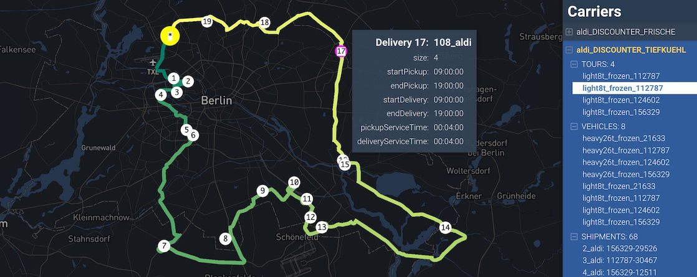

_MATSim carrier plans_

## Usage

A file named `viz-carrier*.yaml` must be present in working folder. Each yaml/yml file matching that pattern will produce a separate carrier visualization.

**viz-carrier-example.yml**

```yaml
title: 'Grocery delivery carriers'
description: 'Berlin open scenario'
network: output_network.json.gz # slower: output_network.json.gz
carriers: output_carriers.xml.gz
center: [13.4, 52.5]
```

## YAML fields explained

**title:** title of the panel

**description:** brief text description

**network:** Generally this should be the `output_network.xml.gz` filename that was used for the logistics run

**carriers:** The carrier file output, usually of the form `*output_carriers.xml.gz`

**center:** Use this to force the map center point. `[long,lat]`

**zoom:** zoom level 5-20
