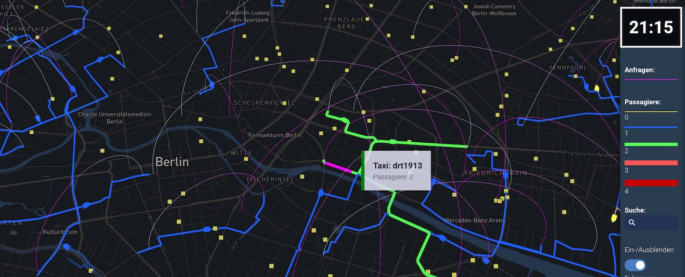

_Animation of DRT vehicle, paths, and passenger requests_

## Usage

A file named `viz-vehicles-*.yaml` must be present in working folder. Each yml file matching that pattern will produce a separate DRT visualization.

**viz-vehicles-drt.yaml**
```yaml
title: 'Dynamic Response Shared Taxis'
description: Inaktive Sammeltaxis (Quadräte); Aktive Sammeltaxis (gelb)
drtTrips: drt-vehicles.json.gz
thumbnail: thumbnail-vehicles.jpg
center: [13.391, 52.515]
leftside: false
```

This view can also be embedded in a dashboard by including `type: vehicles` in the properties.

## YAML fields explained

**drtTrips:** the output from the [parse-drt-link-events.py](https://github.com/simwrapper/simwrapper/raw/master/scripts/parse-drt-link-events.py) script, gzipped for best performance

**center:** Use this to specify the map center point as `"long, lat"` or `[long,lat]`. This is also used to properly scale the vehicle icons so it's good to always set it.

**leftside:** Offset vehicles slight to the left-of-center instead of right-of-center to depict left side driving correctly. (Default false)
