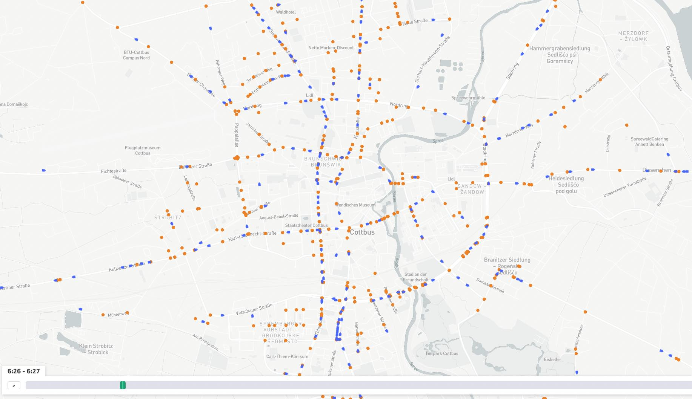

_MATSim event animation_

# EXPERIMENTAL

**The event viewer is under development and is not yet released. We are currently researching the best way to ingest the very large MATSim event files in a streaming manner, in order to produce useful animations or other visualizations from them.**

If you have specific use cases for a MATSim event viewer, please let us know! We would definitely like to add this in the future.

<!--- _Currently, we can load an_ `output_events.xml.gz` _file but it takes a very long time (many minutes for a typical simulation), and then the vehicle animation displays but does not yet have any configuration._

_This is a technology test; feel free to try it out. We will hopefully update it to be more featureful soon._

## Usage

If the file `output_events.xml.gz` exists in a folder, the events viewer panel will be available. There is no YAML configuration available.

Event animations cannot be embedded in a dashboard.

-->
