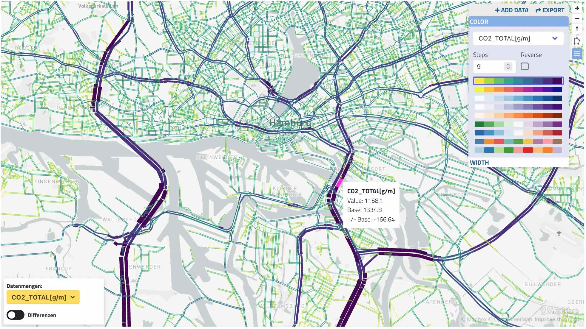

_Bandwidth plot. Colors and widths can specify different data,_

The network link plot supports typical transport "bandwidth plots" as well as many other types of data. If your data can be attached to link via the link ID, you can use this plot!

Supports display of data from multiple datasets, including "difference plots" which can compare two datasets, e.g. base vs. build.

> Note: the "shapefile" viewer can also display MATSim networks, and is more feature-rich: including curvy lines from GeoJSON and more. Try them both!

## Usage

You can create a link visualization as a standalone view, as part of a dashboard, or you can create it interactively from a raw network file.

1. A standalone visualization is defined with a file named `viz-links-*.yaml` in your working folder. Each yaml file matching that pattern will produce a separate link volume diagram.

2. Link plots can be included in [dashboards](dashboards) using `type: links`. See the example YAML config below.

3. Or, you can open a network file directly by browsing to it from the SimWrapper site, and then click **Add Data** in the configuration panel in the upper right to attache CSV data files to it. Once you have added data and configured the colors and widths, use the **Export** button to download the YAML file.
  - Your browser will probably place the file in your Downloads folder; you'll need to move it to the correct data folder and name it appropriately.

**Standalone: viz-links-example.yaml**

```yaml
title: 'Passagiers in DRT Vehicles'
description: 'Hourly passengers, build scenario'
csvFile: 'hourlyTrafficVolume-drt-vehicles.csv'
csvBase: '../base/hourlyTrafficVolume-drt-vehicles.csv'
network: '*output_network.xml.gz'
thumbnail: thumbnail-roads.jpg
```

**Dashboard: dashboard-example.yaml**

```yaml
header:
  title: My Dashboard
  fullscreen: true

layout:
  row1:
    - type: links
      title: 'Link example'
      description: 'Sample data'
      network: '../input/base/output_network.xml.gz'
      projection: EPSG:25832
      center: 13.45, 52.5
      zoom: 9
      showDifferences: true
      datasets:
        csvFile: 'output/reallab2030/accidentCosts.csv.gz'
        csvBase: '../base/output/accidentCosts.csv.gz'
      display:
        color:
          dataset: csvFile
          columnName: 18:00-20:00
          colorRamp:
            ramp: Viridis
            steps: 9
        width:
          dataset: csvFile
          columnName: CostsperYear
          scaleFactor: 10
```

## Attaching CSV data to your network link visualization

Any CSV datafile can be used to attach data to the network visualization. Each link in your network must have a unique ID, and the CSV file must have one row per link, with the link ID as the first column. No other arrangement will work.

Use whatever method you like to produce a CSV for your data; most of us either build the dataset from event listeners within MATSim, or through post-processing using Python or R. But as long as you can create a CSV file with link IDs and values that you need, the method doesn't matter.

**Column names** The CSV file should have a header line as the first line of the file. This header should contain column names, or labels, for every column. E.g. hour of the day, type of pollutant, etc.

- First column **must be** the link ID, identical to the link IDs in the network file
- All remaining columns will be available and will be labeled according to the file header.
- **Note:** older versions of SimWrapper used to autogenerate a "sum" column. This has been removed. If you want to show a "sum" total column, you will have to calculate it yourself as a separate column in your data file.

---

## YAML fields explained

**Filename fields** can refer to subfolders and to parent folders using `"../"`. This works all the way up folder hierarchy: up to the base of the filesystem, specified in `fileConfig.js`

- example: `network: "../networks/base.json.gz"`

### Field descriptions

**title:** (optional) title of the visualization, appears right on top of the map. If a title is specified both under `general` and under `props`, the one under `general` will be used.

**description:** (optional) description of the visualization, appears between title and map. If a description is specified both under `general` and under `props`, the one under `general` will be used.

**csvFile:** dataset in CSV or TSV format.

- Columns are autodetected and will split at commas, semicolons, or tabs.
- Numbers **must be in 1234.56 format** -- European "1.234.567,00" formats will not work.

**csvBase:** (optional) "base" dataset for difference plots. If `csvBase` is specified, "diff mode" will be enabled and difference plots can be automatically generated.

- Differences are always calculated as `'csvFile - csvBase'`

**network:** Specify either at MATSim `output_network.xml.gz` network file, or a geojson-format network file. The geojson format loads much faster, but requires that you create it first.

- Use the python script [create-geojson-network.py](https://raw.githubusercontent.com/simwrapper/simwrapper/master/scripts/create-geojson-network.py) to create a geojson network from a MATSim network.xml.gz file.
- Command is `python create-geojson-network.py [my_output_network.xml.gz] [Projection]`
- and will create a file with the name `mynetwork.geo.json.gz`.

**projection:** projection must be given! Format `EPSG:25832` etc.

**geojsonFile:** (deprecated) - same as `network`.

**thumbnail:** (optional) file path to a thumbnail in jpg format

**center:** (optional) coordinates that the map centers on. Can be provided as array or string. If it is not provided, a center is calculated using a sampling of the data.

**zoom:** (optional) zoom level of the map. If it is not provided, the zoom level 9 is used.

**showDifference:** allows difference plots to be created if a base case is provided. Should be `true`.

**display:** The optional display section includes details of the color and width data specifications.

## Defining Colors and Widths

Colors and widths can be based on the CSV data. They are defined in the `display:` section of the YAML.

### Color

The `color` section may include the following properties:

> color settings are **IGNORED** if `showDifferences` is true. Differences mode always displays links in solid blue or red depending on +/- diff value.

- **dataset** required. The ID of the csv datafile itself; in the example above, `csvFile` is one key and `csvBase` is another. This tells SimWrapper which dataset you want to use.
- **columnName** The name of the column containing color values
- **colorRamp** This section can have multiple settings:
  - `ramp`: The name of the color progression (default `Viridis`)
    - `Viridis`, `Plasma`, `Blues`, `Purples`, `Oranges`are **sequential**
    - `PRGn` and `RdBu` are **diverging scales** for e.g. differences
    - `Tableau10` and `Paired` are **categorical** (non-ordered)
  - `reversed` true will _flip the order_ of colors (default false)
  - `steps` the number of different colors in the progression (default 9)

### Width

The `width` section includes the following properties:

- **dataset** required. The ID of the csv datafile itself; in the example above, `csvFile` is one key and `csvBase` is another. This tells SimWrapper which dataset(s) you want to display.
- **columnName** The name of the column containing width values
- **scaleFactor** Values will be **divided by** this scaling factor. Set this to `0` to have constant, paper-thin widths (default 100)

---

**example-data.csv**

```
link;01:00:00;02:00:00;03:00:00;04:00:00;05:00:00;06:00:00;07:00:00;08:00:00;09:00:00;10:00:00;11:00:00;12:00:00;13:00:00;14:00:00;15:00:00;16:00:00;17:00:00;18:00:00;19:00:00;20:00:00;21:00:00;22:00:00;23:00:00;24:00:00;25:00:00;26:00:00;27:00:00;28:00:00;30:00:00
72539930;0;0;0;0;7;13;20;16;13;15;18;17;32;25;29;55;53;43;48;12;12;10;4;4;4;0;0;0;0
42868713;0;0;0;0;0;0;0;0;0;0;0;0;0;1;0;0;1;1;0;0;0;0;0;0;0;0;0;0;0
72539936;0;1;0;0;17;57;63;52;51;47;49;59;78;67;73;113;99;98;107;47;38;36;24;13;4;0;0;0;0
6173553;0;1;0;3;5;1;10;10;9;3;8;4;6;3;4;9;5;7;4;2;1;1;1;2;0;1;0;0;0
```

## Deprecated fields, do not use:

**shpFile,dbfFile, shpFileIdProperty:** (deprecated) filenames for the alternative, slower network file in shapefile format. Don't use this if you have created the geojson network file above.

**widthFactor:** (deprecated) Width values used to be uniformly scaled by this value. See **Colors and Widths** on this page.

**sampleRate:** (deprecated) This option used to specify the MATSim simulation sample rate; i.e. a 1% sample would use `0.01` here so that volumes were scaled properly. This is NOW IGNORED; you must scale your CSV data appropriately.
