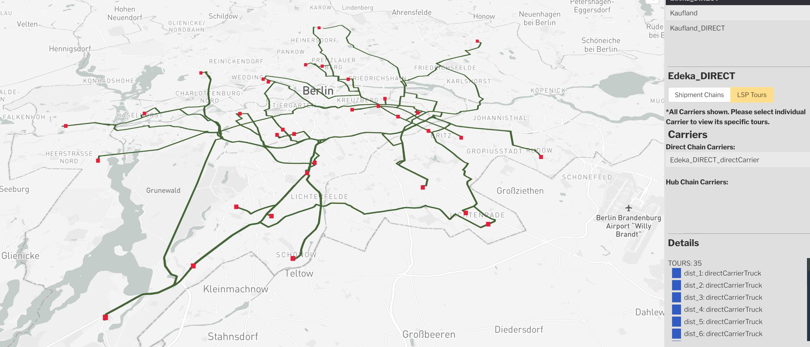

_MATSim logistics viewer_

## Usage

From the SimWrapper file browser, click on any `*output_logistics.xml.gz` file to open it in the browser. For this to work, a similarly-named `*output_network.xml.gz` file must be in the same folder.

Alternatively, a file named `viz-logistic*.yaml` can define the filenames of the logistic and network files. Each yaml file matching that pattern will produce a separate logistics visualization.

**viz-logistic-example.yml**

```yaml
title: 'Logistics demo'
description: 'Multiple depots'
network: output_network.xml.gz
carriers: output_carriers.xml.gz
lsps: output_lsps.xml.gz
center: [13.4, 52.5]
zoom: 9
```

## YAML fields explained

**title:** title of the panel

**description:** brief text description

**network:** Generally this should be the `output_network.xml.gz` filename that was used for the logistics run (required)

**carriers:** The carrier file output, usually of the form `*output_carriers.xml.gz` (required)

**lsps:** The logistics (lsps) file output, usually of the form `*output_lsps.xml.gz` (required)

**center:** Use this to force the map center point. `[long,lat]`

**zoom:** zoom level 5-20
