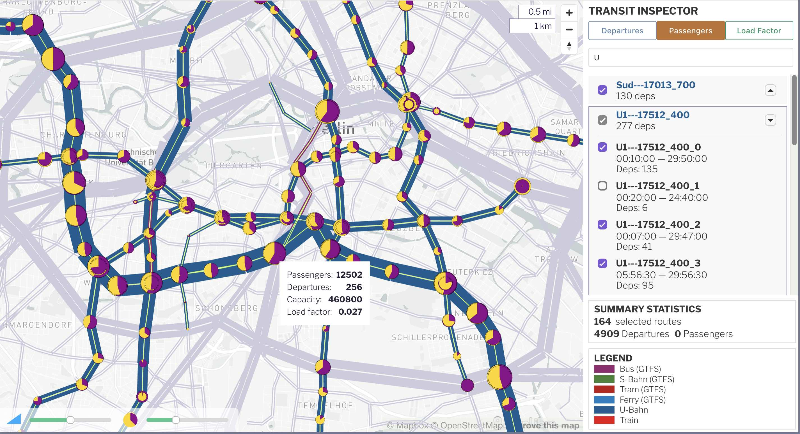

_Public transit routes and station boardings/alightings_

The public transit viewer displays MATSim public transport networks, along with passenger demand if available.

## Usage

If the run folder contains a `*output_transitSchedule.xml.gz` file, then this view will be automatically available.

**Stop-to-stop ridership:** If the run folder also contains an analysis subfolder containing `analysis/pt/pt_pax_volumes.csv.gz` then the public transit ridership (ridership, boardings/alightings, and load factors) will also be loaded. This may take a few extra seconds.

A standalone `viz-pt-*.yaml` file can also be used to set all configuration parameters; see dashboard config below.

### Exploring the transit system

Click on any transit link to see the list of transit routes which traverse that link. You can select any individual route from the details panel to see the extent of the route.

Selecting a transit line or a line's transit routes (routes are always children under one line) by clicking a link or using the search panel.

**Line widths** represent the number of vehicle departures on a specific link. Passenger volumes and load factors are also available if the `stop2stop` file is available.

**Boardings/alightings** will be shown at each stop if the `stop2stop` file is available. They are show as pie charts at each stop location.

## Dashboard and YAML config

The following configuration options are available when embedding the transit viewer in a dashboard or YAML config file.  Use `type: transit` for this plugin.

### Field descriptions

**title:** (optional) title of the visualization, appears right on top of the map. If a title is specified both under `general` and under `props`, the one under `general` will be used.

**description:** (optional) one line additional detail about this view.

**transitSchedule:** (required) the `*transitSchedule.xml.gz` file from the simulation.

**demand:** (optional) path to the passenger volumes file. This file can be automatically generated from the MATSim PT module. Default value is `analysis/pt/pt_pax_volumes.csv.gz` and the viewer will look in that path if nothing is specified for `demand`.

**network:** The MATSim network file that matches the transit schedule. The following network formats are supported. If no network is specified in a YAML config, these files are searched for in the folder containing the transit schedule:
- Avro: `*network.avro` file using the new MATSim Avro network format. Avro network files are smaller and load faster than XML. If your simulation doesn't create this automatically, you can generate it using this Python script: [create-avro-network.py](https://github.com/simwrapper/simwrapper/raw/refs/heads/master/scripts/create-avro-network.py)
- XML: standard `*network.xml.gz` MATSim output network
- GeoJSON: Network files converted to GeoJSON also work.

**projection:** (optional) the EPSG code e.g. "EPSG:25832" which specifies the coordinate reference system in use. Most recent MATSim networks, including Avro files, already have this embedded, but sometimes it is incorrect or set to "Atlantis". You must have the correct EPSG code to place the network on a background map.

**colors:** (optional) a list of rules to assign color codes to transit lines. If unset, the default set is used which is based on GTFS codes and/or the `transportMode` attribute from each transit route. See below for a detailed description.

**customRouteTypes:** (deprecated) same as `colors:` above.

### Route color configuration

The default colors use GTFS codes if available, followed by the `transportMode` attribute. But you might want to modify the the default colors.

`colors` is interpreted as a **list of rules**. Here's how it works; see the example below which makes it easier to understand.

- Each transit route starts at the top of the list and works its way down the list until it finds a matching rule.
- Each rule consists of **match criteria**, a **color code**, and a **label** for the legend. An option **hide** boolean can be set as well.
- The `match` criteria are one more route property keys such as _gtfsRouteType_ or _transportMode_ or _id_, followed by the value or set of possible values for that key.
- The first rule that matches ALL criteria for this route is used as the label and color for this transit route.
- If any of the match criteria in a rule do not match the details of the current route, this rule is skipped and the next rule on the list is tried. This continues down the list until a rule matches for the route.
- A default color is used for "Other" if no rules match at all.

The `color:` field in a rule can either a [standard CSS color](https://i.pinimg.com/originals/ad/07/fa/ad07fab27cc455481593fe3704cdd800.png) such as red, yellow, green; or a [CSS hex code](https://www.kindpng.com/picc/m/197-1970796_hex-color-code-samples-png-download-hexagonal-color.png) such as `#ff0` for more options.

The `match:` property can be either a single value (string or numeric), or a list of possible values -- only one of which needs to match. So you can set `transportMode: 'rail'` or `transportMode: ['rail', 'subway']` and the transport mode must be "rail" in the first case and must be "rail" OR "subway" in the second.

An optional `hide: true` can be included on any rule to hide any routes which match that rule.

If a rule contains multiple match criteria, ALL of them must match for the rule to be used. So, you can say you want `transportMode: 'rail'` AND `id: 'M*'` to be red for "Metro" routes.

Some examples of rules:

```yaml
# Three rules to set colors for S-Bahn, U-Bahn, and Bus/Other
colors:
  - label: "S-Bahn" # for the legend
    color: "red" # CSS color or "#00ff00" hexcode in quotes
    match:
        transportMode: ["rail","subway"]  # match either rail OR subway
        id: "S*" # AND match all lines beginning with "U"

  - label: "U-Bahn" # for the legend
    color: "blue"
    match:
        transportMode: ["rail","subway"]  # match either rail OR subway
        id: "U*" # AND match all lines beginning with "U"

  - label: "Bus/Other" # for the legend
    color: "#660" # hex color codes must be in quotes
    match:
        id: "*" # Match everything else: catch-all.
```

GTFS codes are often on MATSim networks generated from Open Street Map data. At VSP we find that using GTFS codes from `gtfsRouteType` first (at the top of the list), followed by `transportMode` rules lower down as a backup works pretty well.

Note that the match value can be a single string or number; or it can be a list of possible values (only one of which needs to match).


### Example dashboard.yaml
```yaml
layout:
  row1:
    - type: transit
      title: Transit Explorer
      description: My simulation
      network: "*output_network.xml.gz"  # or "network.avro"
      transitSchedule: "*transitSchedule.xml.gz"
      demand: "analysis/pt/pt_pax_volumes.csv.gz"
      # Provide the EPSG coordinate system if crs is not embedded in network file
      projection: EPSG:25832
```

### Example dashboard.yaml with Avro network and color specifications based on GTFS and/or transportMode
```yaml
layout:
  row1:
    - type: transit
      title: Transit Explorer
      description: My simulation
      transitSchedule: "*transitSchedule.xml.gz"
      network: "*network.avro"
      colors:
        - label: 'Bus (GTFS)'
          color: '#95276E'
          match:
             gtfsRouteType: [3, 700, 701, 702, 703, 704]

        - label: 'S-Bahn (GTFS)'
          color: '#408335'
          match:
             gtfsRouteType: [109]

        - label: 'U-Bahn (GTFS)'
          color: '#115D91'
          match:
             gtfsRouteType: [401,402]

        - label: 'Tram (GTFS)'
          color: '#BE1414'
          match:
             gtfsRouteType: [0, 3, 900, 901, 902, 903, 904, 905, 906]

        - label: 'Rail'
          color: 'red'
          match:
             transportMode: ["train","rail"]

        - label: 'Bus'
          color: '#070'
          match:
             transportMode: "bus"

        - label: 'Other'
          color: 'darkMagenta'
          match:
             id: "*"


```


