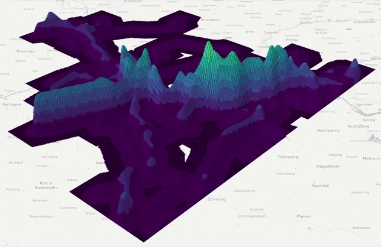
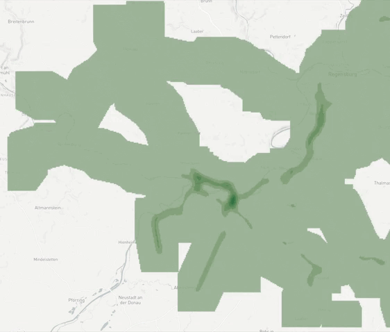

<div style="display: flex; flex-direction: row; height: 300px">
  
  
  

</div>

_(1) Grid Layer plot at a fixed time (2) Grid Layer plot over a period of time (3) 2D Grid Layer plot over a period of time._

Grid Layer Plots are excellent for plotting emissions or other data at a specific point in time or over a period of time. The plot can create a grid layer in 2D and 3D, both at a specific time point and across multiple time points.

## Creating this panel

Grid Layer plots can be created in a dashboard file by placing them in the layout: section of a dashboard-*.yaml file. You can refer to the examples at the end of this document for reference.

**Embed in Dashboard:** Create a `dashboard-*.yaml` file and include a `type: map` section as described below.

- Each area map panel is defined inside a **row** in a `dashboard-*.yaml` file.
- Use panel `type: gridmap` in the dashboard configuration.
- Standard title, description, and width fields define the frame.
- See [Dashboard documentation](dashboards) for general tips on creating dashboard configurations.

## Embed in Dashboard

In addition to the standard dashboard configurations, the following properties are available: 

**file:** String. The filepath containing the csv-file.

**cellSize:** Number. The cellsize of the grids in meters.

**maxHeight:** Number. The maximum height of the cells in meters.

**projection:** Number. The projection of the coordinates.

**opacity:** Number. The opacity of the cells.

**center:** Number[]. The coordinates of the center of the map. 

```yaml
layout:
  row1:
    - title: "Grid"
      description: "Total DRT origins/destinations by area"
      type: gridmap
      cellSize: 100
      height: 8
      maxHeight: 100
      projection: EPSG:25832
      opacity: 0.5
      file: emissions_grid_per_hour.xyt.csv.gz
      center: [11.88618, 48.91725]
```

## CSV File

The CSV file requires the columns x, y, and time, and optionally the time column if multiple time periods are to be considered. Here is an example:

```csv
time,x,y,value
0.0,689832.37,5406667.71,0.0
0.0,689832.37,5406767.71,0.0
0.0,689832.37,5406867.71,0.0
0.0,689832.37,5406967.71,0.0
0.0,689832.37,5407067.71,0.0
0.0,689832.37,5407167.71,0.0
0.0,689832.37,5407267.71,0.0
0.0,689832.37,5407367.71,0.0
0.0,689832.37,5407467.71,0.0
```