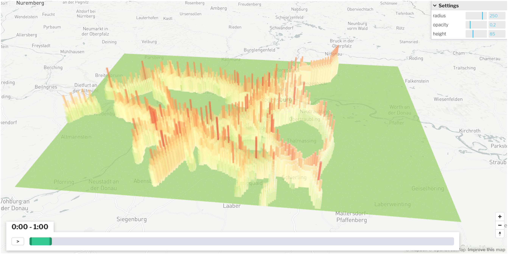

_Gridmap plot over a period of time_

Gridmap Plots are excellent for plotting emissions or other data at a specific point in time or over a period of time.

## Creating this panel

Gridmap plots can be read in a dashboard file they go in the `layout:` section of a `dashboard-*.yaml` file. See the examples at the end of this document.


**Embed in Dashboard:** Create a `dashboard-*.yaml` file and include a `type: gridmap` section as described below.

- Each area map panel is defined inside a **row** in a `dashboard-*.yaml` file.
- Use panel `type: gridmap` in the dashboard configuration.
- Standard title, description, and width fields define the frame.
- See [Dashboard documentation](dashboards) for general tips on creating dashboard configurations.


## Embed in Dashboard

In addition to the standard dashboard configurations, the following properties are available:

- **file:** *String*. The file path to the .avro file containing the data. ([Avro Schema](#avro-schema))

- **cellSize:** *Number*. Specifies the width/height of the grid elements (must be between 50 and 300). This value can be adjusted in the UI via the settings.

- **opacity:** *Float*. Defines the opacity of the grid map. The value must be between 0 and 1 and can also be changed in the UI via the settings.

- **maxHeight:** *Number*. Specifies the maximum height of the 3D grids. Must be a positive integer.

- **colorRamp/ramp:** *String*. Specifies the colorramp. Possible colorramps are: *Inferno*, *Magma*, *Viridis*, *Greens*, *Reds*, *RdYlGn*, *greenRed*. The default value is *Viridis*.

The `.yaml` file could then look like this (Here are both variants of how to define breakpoints. However, only one of the two variants may be used at most):

```yaml
- type: gridmap
  title: Noise Immissions
  description: Noise Immissions per day
  height: 12.0
  file: analysis/noise/immission_per_day.avro
  cellSize: 250
  opacity: 0.2
  maxHeight: 20
  colorRamp:
    reverse: false
    ramp: greenRed
    steps: 10
```

### Avro Schema

The Avro schema defines the structure of the data stored in the Avro format. It consists of a record with several fields containing different types of information. Below is an explanation of the key fields:

- **crs** (*string*): This field stores the Coordinate Reference System (CRS) used for the spatial data.
  
- **xCoords** (*array of floats*): A list of X coordinates representing the horizontal positions in a Cartesian coordinate system.
  
- **yCoords** (*array of floats*): A list of Y coordinates representing the vertical positions in a Cartesian coordinate system.
  
- **timestamps** (*array of integers*): A list of timestamps in seconds. Each timestamp corresponds to an X-Y coordinate pair and represents the time at which the position was recorded.
  
- **data** (*map of arrays of floats*): A mapping of keys to arrays of floating-point numbers. This field contains the XYT data, which are coordinates and associated values tied to the timestamps.

This structure is optimized for storing spatio-temporal data, useful for applications such as geospatial data processing or simulations that handle such information.

```json
{
  "type" : "record",
  "name" : "XYTData",
  "namespace" : "org.matsim.application.avro",
  "fields" : [ 
    {
      "name" : "crs",
      "type" : "string",
      "doc" : "Coordinate reference system"
    }, 
    {
      "name" : "xCoords",
      "type" : {
        "type" : "array",
        "items" : "float"
      },
      "doc" : "List of x coordinates"
    }, 
    {
      "name" : "yCoords",
      "type" : {
        "type" : "array",
        "items" : "float"
      },
      "doc" : "List of y coordinates"
    }, 
    {
      "name" : "timestamps",
      "type" : {
        "type" : "array",
        "items" : "int"
      },
      "doc" : "List of timestamps in seconds"
    }, 
    {
      "name" : "data",
      "type" : {
        "type" : "map",
        "values" : {
          "type" : "array",
          "items" : "float"
        }
      },
      "doc" : "XYT data"
    } 
  ]
}
```