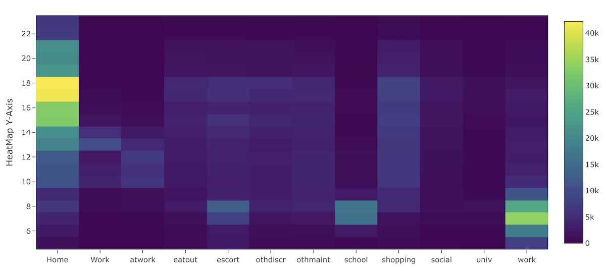

_Heatmap depicting Time of day vs. activity purpose_

A heatmap chart depicts aggregate data in two dimensions on one chart.

## Usage

Heatmap charts can only be included as panels in **Dashboards**. See Dashboard documentation for general tips on creating dashboard configurations.

- Use panel `type: heatmap` in the dashboard configuration.
- Each heatmap panel is defined inside a **row** in a `dashboard-*.yaml` file.
- Standard title, description, and width fields define the frame.

---

### Sample dashboard.yaml config snippet with a heatmap

```yaml
layout:
  row1:
    - title: "My Heatmap"
      type: heatmap
      dataset: "trips-tod-wide.csv"
      y: depart
      columns: ['Home','Work','atwork','eatout','escort','othdiscr','othmaint',
                'school','shopping','social']
      xAxisTitle: "Activity Purpose"
      yAxisTitle: "Time of Day (Hour)"
      flipAxes: true
```

---

### Heatmap chart properties

Heatmap chart properties:

**dataset:** String. The filepath containing the data. May include wildcards \* and ?.

**y:** column containing y-value data.

**columns:**: Array[] containing names of columns with data to be categorized on the x-axis. See example above.

**xAxisTitle** and **yAxisTitle**: Descriptive titles for the x-axis and y-axis (optional).

**flipAxes:** True/false. Transpose the heatmap matrix, thus flipping the x and y axes. Can be useful if your data is stored one way but you want it displayed the other.
