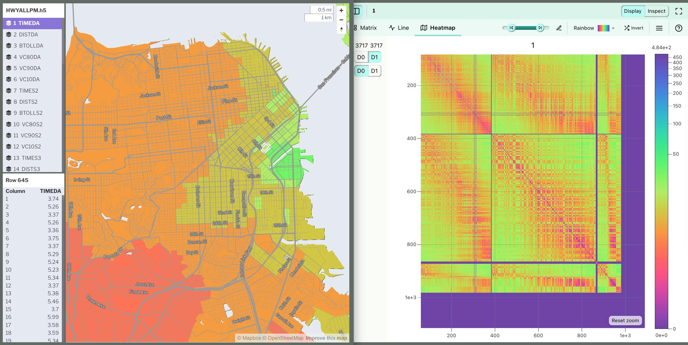

_Matrix viewer showing matrix data on a zonal map and as a tabular heatmap_

The matrix viewer can display HDF5 matrix data as a table or tabular heatmap. In addition, data can be mapped onto a zonal GeoJSON boundary file for the common use cases of viewing aggregate zonal data such as skims and trip tables.

## Usage

- From the front page of SimWrapper, you can choose "Matrix Viewer" and then drag/drop your HDF5 files directly into the viewer

The matrix viewer can also be preconfigured using YAML, and embedded in dashboards or displayed full-screen as such. See Dashboard documentation for general tips on creating dashboard configurations.

- Use panel `type: matrix` in the dashboard configuration.
- Each matrix panel is defined inside a **row** in a `dashboard-*.yaml` file.
- Standard title, description, and width fields define the frame.
- Alternatively a file of the pattern `viz-matrix-[more].yaml` can define a standalone matrix viewer

---

### Sample dashboard.yaml config snippet with a heatmap

```yaml
layout:
  row1:
    - type: matrix
      title: "HIGHWAY skims 2020 AM comparison"
      dataset: "HWYAMSKIM.project.h5"
      basedata: "HWYAMSKIM.baseyear.h5"
      shapes:
        file: './geojson/zones1454.geojson'
        id: 'TAZ'       # The geojson property field containing the TAZ column number
      colors:
        ramp: 'RdBu'    # Viridis, Rainbow, etc
        inverted: false
        scale: 'SymLog' # Linear, Log, SymLog, Sqrt.
                        # SymLog is like Log, but works for scales that cross zero (diffs!)
```

---

**dataset:** The HDF5-format file to be viewed

**basedata:** An optional base from which to compare.  Calculations are always `dataset - base`.

**shapes:** The `file` filename of the GeoJSON data set (optionally .gzipped), and the `id` name of the property containing the TAZ/Column number.

_This viewer is a work in progress, more docs to come!_

## Mapping matrix sizes to a specified GeoJSON

Most users of SimWrapper have just a few zonal boundary systems and all of their matrix data corresponds to one of these boundaries.

If you have your own install of SimWrapper, you can specific this relationship directly, so that you only need to tell it once that matrices with 2518 columns always get viewed in the 2518-zone system.  Unfortunately I can't include all of your zone systems in the general build of SimWrapper so this only works if you've got SimWrapper running locally.

The file `/zones/zones.yaml` defines this as follows:

**/zones/zones.yaml** - example
```yaml
# Zone system configurations for matrix plugin -- San Francisco example
#
# Only GeoJSON files are supported. Shapefiles are too slow and often have coordinate problems.
# Use GeoJSON and pre-convert all coordinates to long/lat (WGS84 or EPSG:4326)
#
# URLs can be
# - `/zones/filename.geojson` if you place the file in the /zones folder of the SimWrapper build
# - full HTTP urls if the remote server allows external access

# 'sizes' helps SimWrapper guess which zone systems are appropriate for which matrix sizes.

SF-2454:
  url: /zones/dist15.geojson.gz
  lookup: TAZ
  sizes: 981,2454,2475,3681,3717

MTC-1454:
  url: /zones/mtc1454.geojson.gz
  lookup: TAZ1454
  sizes: 1454,1475

```
