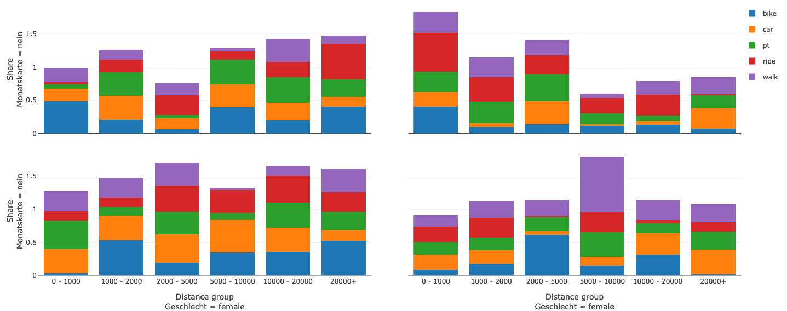

With the Plotly plug-in it is possible to create any Plotly chart including all of the advanced stacked, 3D, and non-cartesian plot types.

If you just need a simple bar/line/area chart, you might want to use the [basic chart plugin](ref-bar-area-line.md) instead.

## Usage

See the **[Plotly documentation](https://plotly.com/javascript/)** which catalogs all of the many chart types available, far too numerous to list here. From there, you can find the configuration details that are required for your chart, and you will write that config into a SimWrapper YAML file -- instead of writing the given Plotly javascript code.

The SimWrapper plotly plug-in can be used to add panels in **Dashboards**. See the [Dashboard documentation](guide-dashboards.md) for general tips on creating dashboard configurations.

- Each plotly panel is defined inside a **row** in a `dashboard-*.yaml` file.
- Use panel `type: plotly` in the dashboard configuration.
- Standard title, description, and width fields define the frame.

## Plotly configuration

**Data traces.** The Plotly examples generally describe data **traces**, each of which can be defined in the `traces` section of the SimWrapper YAML configuration; see below for an example.

**Datasets.** You can specify arrays of data for your x and y data directly in the YAML file, e.g. `x: [1,3,5,10.0]`. More commonly, you will refer to external datasets such as CSV files. For this, create a `datasets:` section in your YAML config.

For example, you could read trip data from a CSV file using `trips: "tripData.csv"`. Then, refer to the columns `timePeriod` and `totalTrips` in that dataset in the `traces` section by **prefixing the key with a $**:

```yaml
datasets:
  trips: "tripData.csv"
traces:
  - x: $trips.timePeriod
    y: $trips.totalTrips
    ...
```
SimWrapper will read the file and insert the appropriate data columns into the configuration automatically. Note the `$` before the keyword that you used for identifying the dataset.

- You can read _multiple datasets_ and refer to columns from each using `$key.column` for each.

**Layout.** Layout is handled by SimWrapper automatically; however if you want to override some layout defaults, you can include a `layout` section. The contents will be merged with the default layout values.

### Additional properties

SimWrapper can preprocess datasets with the following special properties for use with the Plotly plug-in. Note, these are not part of the official Plotly library, but are SimWrapper-specific additions.

These are all specified at the plugin level; so at the same indentation level as `traces`, `dataset` etc.

|**Field**|**Description**|**Default**|
|---------|---------------|-----------|
|colorRamp|String. Set the color ramp that is applied if multiple traces are present. Available color ramp values are on the Plotly docs: see [Discrete](https://plotly.com/python/discrete-color/#color-sequences-in-plotly-express) and [Sequential](https://plotly.com/python/builtin-colorscales/#builtin-sequential-color-scales) color ramps. Note colorRamp can also be specified for a specific trace.||
|fixedRatio|Boolean. Define a fixed ratio for x and y axes domain.|false|
|interactive|String [none, dropdown, slider]. Create an interactive dropdown menu or slider for selecting individual traces.|none|
|mergeDatasets|Boolean. Merge all given `datasets` into one.|false|
|multiIndex|Map<String, String>. Merge two columns as index. Column name as key will be merged with the column name value. This allows building multi-level indices for certain plot types.||

---

### Detailed dashboard example

To generate the plot from the title image, the following code was used. The .csv file does not contain all the data, but is only meant to explain the structure.

```yaml
header:
  title: Plotly example
layout:
  arrivals:
    - type: plotly
      height: 10
      title: Departures
      description: by hour and purpose
      datasets:
        dataset: "analysis/population/trip_purposes_by_hour.csv"
      traces:
        - type: bar
          x: $dataset.h
          y: $dataset.arrival
          name: $dataset.purpose
          orientation: v
          colorRamp: Spectral
      layout:
        xaxis:
          title: Hour
          color: '#444'
          type: '-'
        barmode: stack
        yaxis:
          title: Share
          color: '#444'
          type: '-'
```

#### Example data snippet: trip_purposes_by_hour.csv

|   purpose      |   h   |         arrival           |         departure        |
|:--------------:|:------|:-------------------------:|:-------------------------|
| accomp_children|   9   |    0.0                    | 2.587991718426501E-4    |
| accomp_children|   10  |    2.587991718426501E-4  | 0.0                     |
| ...            |  ...  |    ...                    | ...                     |
| business       |   3   |    2.587991718426501E-4  | 5.175983436853002E-4    |
| business       |   4   |    0.0010351966873706005| 7.763975155279503E-4    |
| ...            |  ...  |    ...                    | ...                     |
| educ_higher    |   6   |    2.587991718426501E-4  | 2.587991718426501E-4    |
| educ_higher    |   7   |    2.587991718426501E-4  | 5.175983436853002E-4    |
| ...    |   ...   |    ...  | ... |

### Pivot

With the pivot attribute, you can modify the dataset by converting it from wide to long format.

|**Field**|**Description**|
|---------|---------------|
|exclude|Array of column names which should be ignored by the converting|
|namesTo|name of the new column that contains the attributes|
|valuesTo|name of the new column that contains the values|

Besides converting, it is also possible to rename columns and normalize values. These two options can also be configured in the pivot attribute.

|**Field**|**Description**|
|---------|---------------|
|rename|The rename Object contains a map where the keys specify the old column name and the values specify the new column name|
|normalize|The normalize Object contains two entries. The `target` entry accepts a column name as a `String` for the columns that should be normalized, while the `groupBy` attribute takes an array of column names as `Strings`. The values will be normalized for the rows where the values from the `groupBy` attribute are identical.|

#### Example pivot data snippet

```yaml
pivot:
  exclude:
    - age
    - dist_group
    - main_mode
  namesTo: names
  valuesTo: values
  rename:
    ref_share: Ref.
    sim_share: Sim.
  normalize:
    target: values
    groupBy:
      - names
      - dist_group
      - age
```

### Facets



To create facets you have to specify the facet_col/facet_row attribute inside the traces array

|**Field**|**Description**|**Example**|
|---------|---------------|-----------|
|facet_col|Defines which values in wich row in the dataset should be seperated into facet columns|`$dataset.age`|
|facet_row|Defines which values in wich row in the dataset should be seperated into facet rows|`$dataset.mode`|

#### Example facets data snippet

```yaml
traces:
- x: $dataset.distance_group
  y: $dataset.share
  orientation: v
  type: bar
  name: $dataset.vehicle
  facet_col: $dataset.sex
  facet_row: $dataset.monthly_pass
```
