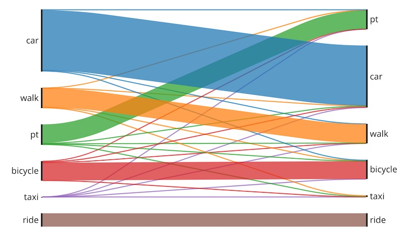

_Mode shifts_

Sankeys are great for showing the shift between two states; for example mode share shift from alt. A to alt. B. You see these a lot in politics after a parliamentary election, to show the change in the number of seats for each party.

## Usage

Standalone: a file named `sankey-*.yaml` must be present in working folder. Each yml file matching that pattern will produce a separate Sankey diagram.

Dashboard: Each panel is defined inside a **row** in a `dashboard-*.yaml` file.

  - Use panel `type: sankey` in the dashboard configuration.

**sankey-example.yaml**

```yaml
# only the csv line is required, but title and description help your viewers
type: sankey
csv: modeshares.csv
title: Sankey Demo
description: Erster Schritt!
sort: true
```

**Sort** determines the order of the options displayed in the chart. (Default: true)

- If **true** (or not present), the available options on both the left and right sides of the chart will be **sorted alphabetically**.
- If **false**, then the graph will display elements **in the order in which they are found in your dataset.** This is useful if e.g. you add a new mode and want it at the top or bottom of the chart, instead of in the middle somewhere based on its name.

## Sankey CSV File format

Header line can contain labels but is CURRENTLY IGNORED

- Column 1: 'From' category
- Column 2: 'To' category. These are not required to match the labels in column 1.
- Column 3: Value
- All other columns ignored

Example:

```
from;to;number of trips (sample size); average change [sec]

car;car;748552;4.851276865
walk;walk;236111;0.064274854
walk;car;1644;-797.9385645
pt;ride;0;0
pt;bicycle;3167;-394.8995895
bicycle;walk;2276;925.78471

ride;bicycle;0;0
```
