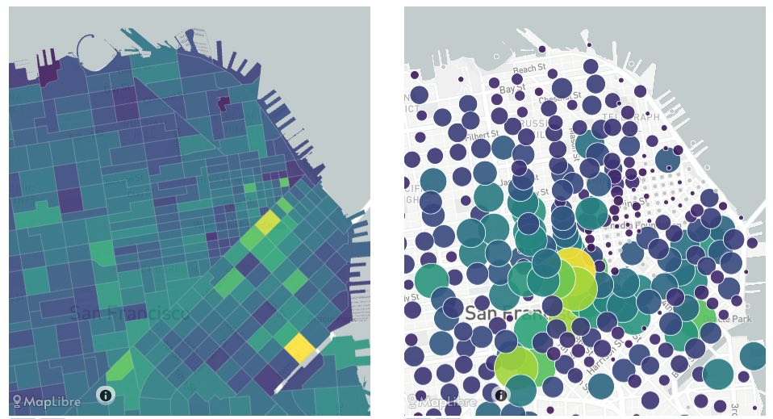

_(1) Area map with "choropleth" color-filled areas; (2) Area map with circles instead of filled areas_

Area maps with filled colors are excellent for depicting spatial data in one dimension.


**NOTE** Both plots are created using the same configuration below. Click the UI button below the maps to switch between the two views.

## Creating this panel

Properties are written in either a standalone `viz-map*.yaml` file, or in a dashboard file they go in the `layout:` section of a `dashboard-*.yaml` file. See the examples at the end of this document.

**Standalone:** Create a `viz-map*.yaml` file as described below

-or-

**Embed in Dashboard:** Create a `dashboard-*.yaml` file and include a `type: map` section as described below.

- Each area map panel is defined inside a **row** in a `dashboard-*.yaml` file.
- Use panel `type: map` in the dashboard configuration. (Note this may change in the future as we add more map types)
- Standard title, description, and width fields define the frame.
- See [Dashboard documentation](dashboards) for general tips on creating dashboard configurations.

> The [SimWrapper example project]() includes sample data and YAML configurations that you can use as a starting point.


## Properties


### Dashboard panel properties

|Property | Usage|
| ---     | ---  |
|`type` | MUST be set to **"map"** in `dashboard-*.yaml` config files |
|`height`| Relative height. Larger numbers create taller panels. (default: 5) |
|`width`| Relative width. The widths of all panels on a single row are summed, and the layout of each panel is then relative to that total width. (default: 1) |


### General properties

|Property | Usage|
| ---     | ---  |
| `title`, `title_en`, `title_de` | Title text for this panel; will be shown just above the map. The language-specific version will be used if provided. |
| `description`, `description_en`, `description_de` | Second line of descriptive text, shown below the title line. The language-specific version will be used if provided. |
| `center` | Coordinates that the map centers on. Can be provided as array or string. If it is not provided, a center is calculated using a sampling of the data. |
| `zoom`|  Zoom level of the map between 5 and 20. (default: 9) |
| `pitch`|  Map pitch (default: 0) |
| `bearing`|  Map bearing/direction (default:0) |

---

### **"shapes:"** the features (links, areas, etc) to be drawn

```yaml
shapes:
  file: my-taz-shapefile.shp
  join: id
  keep: AB,LENGTH,TAZ,SQMILES
```
There are **two separate input types** required for a shapefile/geojson map: (1) the boundaries or shapes themselves, which can be geojson or shapefile format; and (2) additional datasets in CSV/DBF tabular format which contain columns of data that can be attached to the features. These datasets are optional, if the shapefile self-contains all of the required data.

All inputs must contain an _identification column_ in order to **join the datasets** together. In other words, the feature IDs must be present in both datafiles. The names of the columns do not have to be identical, but it helps legibility. See below.


**shapes** section can have the following properties:

|Property | Usage|
| ---     | ---  |
|`file` | String. The filepath of the feature dataset. May include wildcards \* and ?. File can be in _geojson_ format, or a _shapefile_. File type is determined by the filename extension, which must end in either `.geojson` or `.shp` When loading shapefiles, an identically-named `.dbf` and `.prj` file will also be read from the same folder. Be sure to supply a .prj file containing a valid EPSG code if your data is not in lat/long format!|
|`join` | String. The name of the property containing unique shape IDs, or set to `id` if it is in the id field of the geojson itself.|
|`keep` | String (optional). Comma-separated list of fields to KEEP in memory from the shapefile properties. Some files are very large with many properties that you are not interested in. Use the `keep` property to list the only ones you actually need, in order to save memory and improve performance. If `keep` is not specified then all properties are retained.|


### **datasets:** datasets to be joined to the features

```yaml
datasets:
  population: "../pop/2025/population.csv"
  transit-trips:
    file: .summaries/transit-outputs.csv
    drop: bike,ped,MTCTAZ
    keep: TAZ,TIME,pm_vol,orig,dest
```

`datasets:` defines any additional tabular datasets that are linked to the feature dataset from above. Every dataset is defined by a short keyword name followed by a colon, and then the needed properties are provided. In the example above, `population` and `transit-trips` keywords are defined. Use the keyword to refer to the dataset when defining colors and widths (see below).

- In simple cases a filename can be given directly, as in the `population` example above.
- Other properties can be defined to keep/drop certain columns, as in `transit-trips`.

**name of dataset:** Give the dataset a simple name, which will be used in the display settings below. e.g. `tazdata:`

Each subsection can have the following properties:

|Property | Usage|
| ---     | ---  |
|`file`| String. The filepath containing the data. May include wildcards \* and ?. File can be in _CSV or DBF_ format. Any filename not ending in `.dbf` will be parsed as a CSV file, using either commas, tabs, or spaces as delimiters.|
|`drop`| String (optional). Comma-separated list of column names to be dropped from memory; these columns will be unavailable to this visualization. This can save memory and improve performance.|
|`keep`| String (optional). Comma-separated list of column names to be kept in memory for this visualization. This can save memory and improve performance.|

### **display:** define the symbology details: colors, widths, etc

```yaml
display:
  fill:
    dataset: transit-trips
    join: TAZ
    filters: operator, income
    columnName: trip_origins, trip_boards, trip_reslocs
    colorRamp:
      ramp: Plasma
      reversed: true
      steps: 5
```

The `display` section is where you define the details of your map symbology: the line and fill colors, line widths, circle radii, difference calculations, and so on.

Different map types allow different properties. This is an attempt at summarizing the capabilities; not all combinations work for every map type. There are many, many configuration options listed here, and they mimic the user interface options available in the configuration panel.

**Instead of trying to write this YAML from scratch,** try creating a map interactively on the SimWrapper site, and then choosing `EXPORT` from the configuration panel. SimWrapper will produce a YAML file with most/all of your settings and save it in your browser's Downloads folder. You can move this to your data folder and modify as necessary.

|Property | Usage|
| ---     | ---  |
|`dataset`| Name of the dataset from above which includes the data.|
|`columnName`| The column name (or names) containing values to be plotted. If multiple rows have a matching shape ID, all values will be summed together.|
|`colorRamp`| Describe the colors to be used:<br/>**ramp:** Name of the color ramp to use.<br/>Sequential: `Viridis` `Plasma` `Blues` `Greens` `Purples` `Oranges`<br/>Diverging: `PRGn` `RdBu`<br/>Categorical: `Tableau10` `Paired`. Note categoricals only have ten or twelve categories.|
| | **reversed:** true/false|
| | **steps:** Number of steps in the ramp.|
| | **exponentColors:** Optional true/false. If true, values will be scaled exponentially before being drawn. This is often useful if values are concentrated in small areas, and much higher in value than in typical areas.|
| | **diff:** Example `col1 - col2` will activate diff mode|
| | **breakpoints:** Work in progress, comma-separated list of manual breakpoints for data values.|

<!-- |`filters`| (optional) List of any columns which can be used as category filters by the user interactively. Note that _active filters_ will be shown in the URL bar, so curated maps can be shared via URL.|
-->


### filters

```yaml
filters:
   dataset1.trips: "> 0"
   shapes.TAZ: "!=0"
```

In the `filter` section, you can filter dataset with multiple expressions on numerical columns in any dataset.  Keys are of the format `dataset.column: "filter"` and filter can be `==, !=, <, <=, >, >=`

_More filter examples needed!_

### Tooltip

```yaml
tooltip:
  - AM:TOT_VOL
  - AM:TNC
  - freeflow.shp:FACILITY_TYPE
  - freeflow.shp:SPEED
```

By default, the tooltip shows all columns in the shapefile, as well as any columns that are actively being displayed as either a color or a width.

You can customize the tooltip to just show what you are interested as follows:

- Add a `tooltip:` section to the properties, which will be an array of tooltip entries
- Each entry is of format `datasetname:columnname`, so for example `AM_FLOWS:VEHICLE_VOL` will display the AM_FLOWS dataset and VEHICLE_VOL column.
- Use the shapefile/network filename for its columnar data, or the dataset "key" for joined datasets.

## Difference plots

Comparing a base vs. build, project vs. no-project, or scenari A vs. B, is a common need in both network link and area plots. The method for difference plots is the same for both.

### Diffs in the UI

- From the config panel, add **two datasets** such as a base and a build CSV.
- You can now go into the `Color` `Width` panels for your lines or areas to set up the diff.
- Make sure you have the `Join By` selected properly; the id field for each dataset must link to the shape IDs correctly
- With two datasets loaded, the `Compare datasets` dropdown allows you to choose A-B or B-A. You can also select percent difference if desired (for colors)
- **For colors, be sure to choose a diverging color palette:** one with a neutral central color and different colors to the left/right of center.
  - Manual adjustments to color ramps and breakpoints can be edited in the resulting YAML file, see below.

### Diffs in YAML config

As above, two datasets are needed to build a difference plot. The YAML for maps includes several fields relevant for diff plots, all in the relevant `Width` or `Color` sections.

-  The `diff` field references the two dataset names.
  - It is a string with the form `dataset1 - dataset2`.
  - Example `diff: "project - base"`
- Be sure to set the `join` to identify the id fields properly
- For colors choose a `diverging` colorramp. Valid diverging color ramps are `RdBu`,`PrGn`,`RdYlBu`.
- `breakpoints:`: It will auto-guess breakpoints but you can set your own with a comma-separated list of breakpoints. This list must be length `steps`-1.
  - Example: `steps: 5` and `breakpoints: -10,1,1,10` has a neutral central area for values between -1 and 1.

**Example DIFF YAML fragment**
```yaml
shapes:
    file: "../shapefiles/freeflow.geojson"
    # keep: AB,FT,MTYPE,STREETNAME
    join: AB
datasets:
    base: "../2025_Baseline/daily_vols.dbf"
    build: "../2025_Project18th/daily_vols.dbf"
display:
    lineColor:
        diff: build - base
        columnName: DAILY_TOT
        join: AB
        colorRamp:
            ramp: RdBu
#            reverse: true
            steps: 9
            breakpoints: -1000, -500, -100, -10, 10, 100, 500, 1000
    lineWidth:
        diff: build - base
        columnName: DAILY_TOT
        join: AB
        scaleFactor: 100
```

## Some visualization hints

**Normalization**

- Very large and very small areas on the same maps can create misleading visualizations; consider "normalizing" data by land area before plotting it.

**Color choices**

- Use the sequential color palettes for continuous data.
- Use diverging color palettes for difference plots and other situations where data is both positive and negative
- Use categorical colors when there are just a few categories or "buckets" in which the data resides.

## Example YAML configurations: putting it all together

### Sample viz-map-1.yaml standalone configuration

```yaml
title: 'VIZ-MAP 1'
description: 'All day transit usage'
center: [6.9814, 51.57]
zoom: 10
shapes:
  file: '../../shapefiles/geoid.geojson'
  join: id
datasets:
  transit-trips:
    file: .dashboard/transit-data.csv
display:
  fill:
    dataset: transit-trips
    join: geoid
    filters: operator, income
    columnName: trip_origins, trip_boards, trip_reslocs
    colorRamp:
      ramp: Plasma
      steps: 7
```

### Sample dashboard-1.yaml dashboard with an area map

```yaml
header:
  title: 'Trip Destinations'
  description: 'All day'

layout:
  row1:
    - type: map
      title: 'VIZ-MAP 1'
      description: 'All day transit usage'
      height: 10
      center: [6.9814, 51.57]
      zoom: 10
      shapes:
        file: '../../shapefiles/geoid.geojson'
        join: id
      datasets:
        transit-trips:
          file: .dashboard/transit-data.csv
      display:
        fill:
          dataset: transit-trips
          join: geoid
          filters: operator, income
          columnName: trip_origins, trip_boards, trip_reslocs
          colorRamp:
            ramp: Plasma
            steps: 7
```
