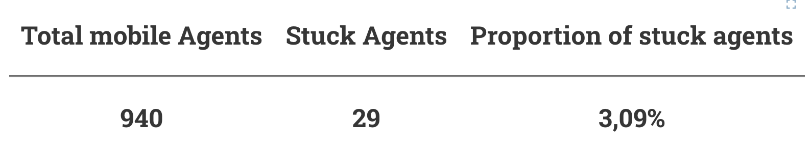

_Tiles_

The Tiles plug in displays key data for a good overview.

## Usage

The tiles plug-in can only be included as panels in **Dashboards**. See Dashboard documentation for general tips on creating dashboard configurations.

- Each table viewer panel is defined inside a **row** in a `dashboard-*.yaml` file.
- Use panel `type: csv` in the dashboard configuration.
- Standard title, description, and width fields define the frame.

---

### Sample dashboard.yaml config snippet

```yaml
layout:
  row1:
    - type: 'tiles'
      title: Example Title
      dataset: 'data.csv'
```

---

### Table viewer properties

Tiles plug-in properties:

**dataset:** String. The filepath containing the csv-file. The first row describes the header text and the second row describes the values

