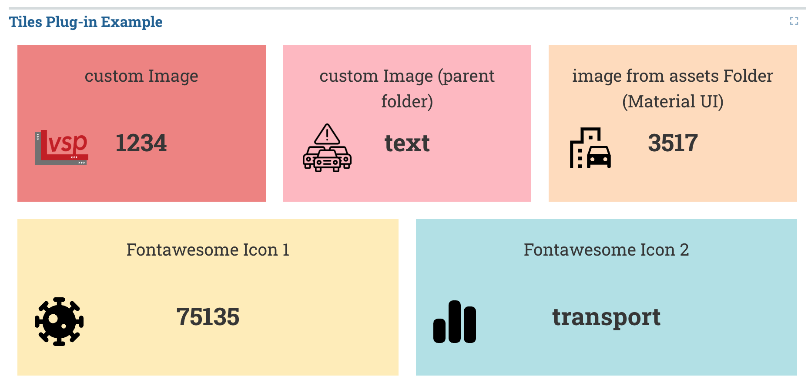
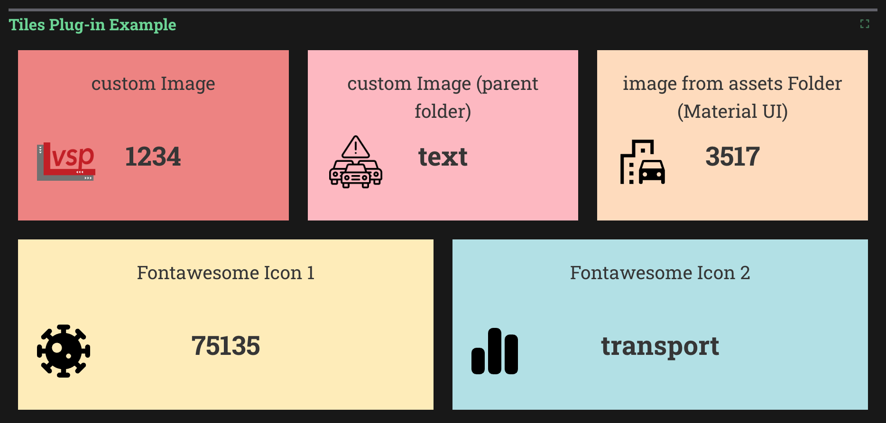

_Tiles_

<!-- 
_Tiles (dark mode)_ -->

The Tiles plug in displays key data for a good overview.

## Usage

The tiles plug-in can only be included as panels in **Dashboards**. See Dashboard documentation for general tips on creating dashboard configurations.

- Each table viewer panel is defined inside a **row** in a `dashboard-*.yaml` file.
- Use panel `type: csv` in the dashboard configuration.
- Standard title, description, and width fields define the frame.

---

### Sample dashboard.yaml config snippet

```yaml
layout:
  row1:
    - type: 'tiles'
      title: Tiles Plug-in Example
      dataset: 'data.csv'
```

---

### CSV Structure

The following .csv structure belongs to the sample image above. The column line contains the titles, the second column the values and the third column the names or paths of the icons. The values and the icons are not required.

<table>
<tbody>
<tr>
<td>custom Image</td>
<td>text</td>
<td>vsp_logo.png</td>
</tr>
<tr>
<td>custom Image (parent folder)</td>
<td>1234</td>
<td>../warning.png</td>
</tr>
<tr>
<td>image from assets Folder (Material UI)</td>
<td>3517</td>
<td>emoji_transportation</td>
</tr>
<tr>
<td>Fontawesome Icon 1</td>
<td>75135</td>
<td>virus-covid</td>
</tr>
<tr>
<td>Fontawesome Icon 2</td>
<td>transport</td>
<td>chart-simple</td>
</tr>
</tbody>
</table>

---

### Add icons to the tile

There are three ways to add icons. When adding icons, these three options are also checked in this order:

1. **Custom Icons:** To add your own icons, the file must be in the same directory and the relative path (including extension) must be specified in the .csv file.

2. **Predefined Icons:** See [Predefined Icons](###predefined-icons). For adding only the name (without extension) must be specified.

3. **Font Awesome Free Icons:** For adding these icons only the name must be specified. An overview of the available icons can be found [here](https://fontawesome.com/search?o=r&m=free&s=solid). Only the icons from the Solid series will work.

---

### Predefined Icons

|                    Name                    |      Icon     |
|:--------------------------------------------:|:---------------|
||departure_board| 
||electric_car| 
||route| 
||local_gas_station| 
|And many more...|And many more...|

For a complete overview, you can check [here](https://github.com/simwrapper/simwrapper/tree/overview-panel/src/assets/tile-icons). You can also add more icons and save them in this folder. Please use this [link](https://fonts.google.com/icons) and select these options for a consistent design: Grade: 0; Fill: true; Weight: 400; Optical Size: 48px.

---

### Table viewer properties

Tiles plug-in properties:

**dataset:** String. The filepath containing the csv-file. The first row describes the header text and the second row describes the values

---

### Notes

- Currently, Predefined Icons can't be used. [GitHub Issue](https://github.com/simwrapper/simwrapper/issues/274)