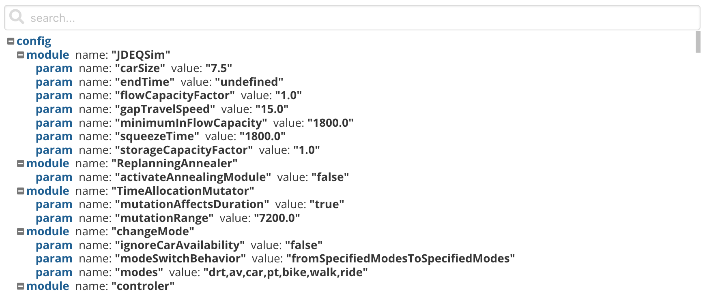

_XML Viewer_

The XML Viewer is able to display XML files clearly and also to search for entries in the XML file.

## Usage

The XML Viewer can only be included as panels in **Dashboards**. See Dashboard documentation for general tips on creating dashboard configurations.

- Each table viewer panel is defined inside a **row** in a `dashboard-*.yaml` file.
- Use panel `type: xml` in the dashboard configuration.
- Standard title, description, and width fields define the frame.

---

### Sample dashboard.yaml config snippet

```yaml
layout:
  row1:
    - type: 'xml'
      title: Example Title
      file: 'data.csv'
      unfoldLevel: 1
```

---

### XML Viewer properties

XML Viewer properties:

**file:** String. The filepath containing the csv-file.

**unfoldLevel:** Number. With this option you can define how many levels should be unfolded at the beginning. 0 means that the top node is not unfolded, 1 means that the top node is unfolded, etc. The default value is 0.