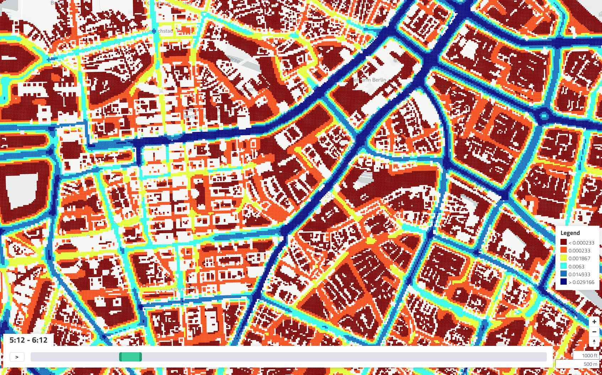

_X/Y/T point-based emissions data example_

Display disaggregate point data with a time component; useful for emissions, noise, etc.

# EXPERIMENTAL

_We are currently researching the best way to ingest very large X/Y/Time data files._

_Currently, SimWrapper can load an_ `*.xyt.csv` _file but it takes a long time (up to a few minutes for some simulations), and then the viz displays._

_This is a technology test; feel free to try it out. We will hopefully update it to be more featureful soon._

## Usage

If a file with name matching `*.xyt.csv` exists in a folder, the X/Y/T viewer will be available. There is no YAML configuration available, but there is an interactive panel for modifying the color attributes.

X/Y/T visualizations cannot be embedded in a dashboard.
