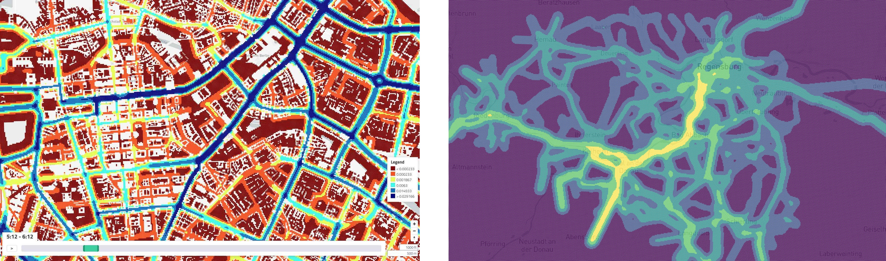

_(1) X/Y/Time plot over a period of time (2) X/Y/Time plot at a fixed point in time._

X/Y/Time Plots are excellent for plotting emissions or other data at a specific point in time or over a period of time.

## Creating this panel

X/Y/Time plots can either be read in via a standalone `*.xyt.csv` file, or in a dashboard file they go in the `layout:` section of a `dashboard-*.yaml` file. See the examples at the end of this document.

**Standalone:** Create a `*.xyt.csv` file as described below

-or-

**Embed in Dashboard:** Create a `dashboard-*.yaml` file and include a `type: map` section as described below.

- Each area map panel is defined inside a **row** in a `dashboard-*.yaml` file.
- Use panel `type: xytime` in the dashboard configuration. (Note this may change in the future as we add more map types)
- Standard title, description, and width fields define the frame.
- See [Dashboard documentation](dashboards) for general tips on creating dashboard configurations.


## Standalone ##

If a file with name matching `*.xyt.csv` exists in a folder, the X/Y/T viewer will be available. 
The file requires the definition of the coordinate system and four columns: time, x, y, value. So for each time and coordinate the value can be mapped.

For example, the file might look like this:

```csv
# EPSG:25832
time,x,y,value
0.0,689832.37,5406667.71,0.0
0.0,689832.37,5406767.71,0.0
0.0,689832.37,5406867.71,0.0
0.0,689832.37,5406967.71,0.0
0.0,689832.37,5407067.71,0.0
0.0,689832.37,5407167.71,0.0
0.0,689832.37,5407267.71,0.0
0.0,689832.37,5407367.71,0.0
0.0,689832.37,5407467.71,0.0
```

## Embed in Dashboard

In addition to the standard dashboard configurations, the following properties are available: 

**file:** String. The filepath containing the csv-file.

**breakpoints:** Object/Array. Defines the breakpoints. Either only the breakpoints can be defined as an array or the breakpoints including colors and values can be defined in an object. Colors and values are described in *colors* and *values* respectively. ***Important***: The number of colors must be one more than the number of values.

**colors:** Array. Defines the colors of the breakpoints

**values:** Array. Defines the values of the breakpoints

**radius:** Number. Defines the radius of the circles (Must be between 5 and 50)

The .yaml file could then look like this (Here are both variants of how to define Brteakpoints. However, only one of the two variants may be used at most):

```yaml
- type: xytime
  title: CO₂ Emissions
  description: per day
  height: 12.0
  radius: 50
  breakpoints: # Breakpoint variant one
    colors:
      - '#440154'
      - '#31658D'
      - '#39B677'
      - '#FDE725'
    values:
      - 0.000233
      - 0.003731
      - 0.018888
  breakpoints: [0.000233, 0.003731, 0.018888] # Breakpoint variant two
  file: analysis/emissions/emissions_grid_per_day.xyt.csv
```
