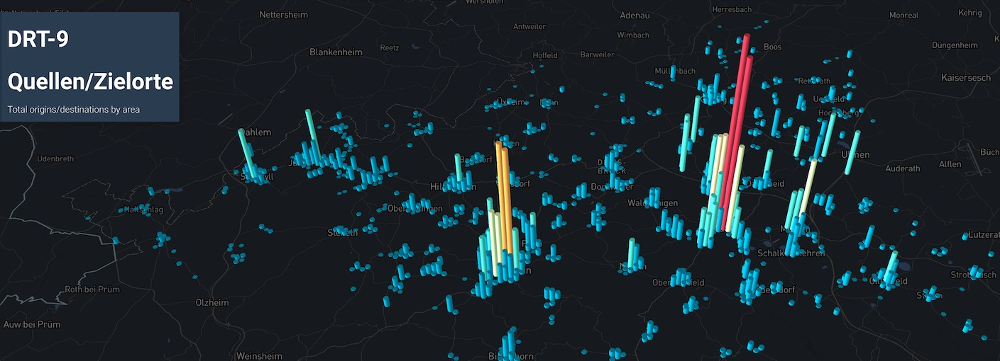

_Origin/Destination summary_

Count the number of things that occur inside hexagons of arbitrary size.

## Usage

A file named `viz-xy-*.yml` must be present in working folder. Each yml file matching that pattern will produce a separate XY Hexagon diagram.

**viz-xy-example.yml**

```yaml
title: "XY Example-1: DRT Vehicles"
description: "Total origins/destinations by area"
file: drt-vehicles.json.gz
thumbnail: thumbnail-vehicles.jpg
center: [6.9814, 51.57]
zoom: 10
radius: 200
maxHeight: 30
elements: drtRequests # only if json
aggregations:
  OD Summary:
    - title: Origins
      x: fromX
      y: fromY
    - title: Destinations
      x: toX
      y: toY
  Base Runs:
    - title: Origins
      x: baseFromX
      y: baseFromY
    - title: Destinations
      x: baseToX
      y: baseToY
```


**dashboard-xy-example.yml**

```yaml

header:
  tab: 'Example'
  title: 'DRT Vehicles'
  description: "XY plot for DRT vehicles"

layout:
  general:
    - title: 'Summary DRT Vehicles'
      description: 'example on how to use a config file'
      type: 'hexagons'
      props:
        configFile: 'viz-xy-example.yaml'
        
    - title: "Another XY plot"
      description: "descriptions are optional"
      type: "hexagons"
      props:
        height: 10
        width: 2
        file: 'drt-vehicles.csv'
        projection: 'EPSG:25832'
        #elements: features #only for json data
        thumbnail: thumbnail-vehicles.jpg
        center: [6.9814, 51.57]
        zoom: 10
        radius: 100
        maxHeight: 20
        aggregations:
          OD Summary:
            - title: Stops
              x: X
              y: Y
 
```


## YAML fields explained

**title:** (optional) title of the visualization, appears right on top of the map. If a title is specified both under ´general´ and under ´props´, the one under ´general´ will be used.

**description:** (optional) description of the visualization, appears between title and map. If a description is specified both under ´general´ and under ´props´, the one under ´general´ will be used.

**file:** a csv, json or gzip'ed json file containing an array with the data.

**projection:** EPSG code of the projection

**elements:** the name of the property containing the data array (for JSON files only)

**thumbnail:** (optional) file path to a thumbnail in jpg format

**center:** (optional) coordinates that the map centers on. Can be provided as array or string. If it is not provided, a center is calculated using a sampling of the data.

**zoom:** (optional) zoom level of the map between 5 and 20. If it is not provided, the zoom level 9 is used. 

**radius:** starting radius of the hexagons. 

**maxHeight:** (optional) starting height of the hexagons. If it is not provided, 0 is used.

**aggregations:**  a list of `title`, `x`, `y` which say which columns of data in the elements array contain the x,y data. x,y can be column numbers or column names. You can specify multiple aggregations in the data section. _Note: column numbers are zero-based!_


## XY Data File format

JSON and CSV files are supported.

**CSV:** a simple CSV with a header column is all that's needed.

**JSON**: The file must have an object with a property whose name is the element. Here's an example that matches the sample YML above.

In this example, each array element is also an array with xy data in columns 0,1 and 3,4. The row elements can also be regular JSON objects, in which case the x/y columns can be referenced by name instead number.

```json
{
    "drtRequests": [
        [ 6.2343, 52.123, 0, 6.33, 52.23, 0],
        [ 7.0341, 51.237, 0, 7.81, 51.44, 0],
        ...
    ]
}
```

All other elements in the JSON are ignored.
