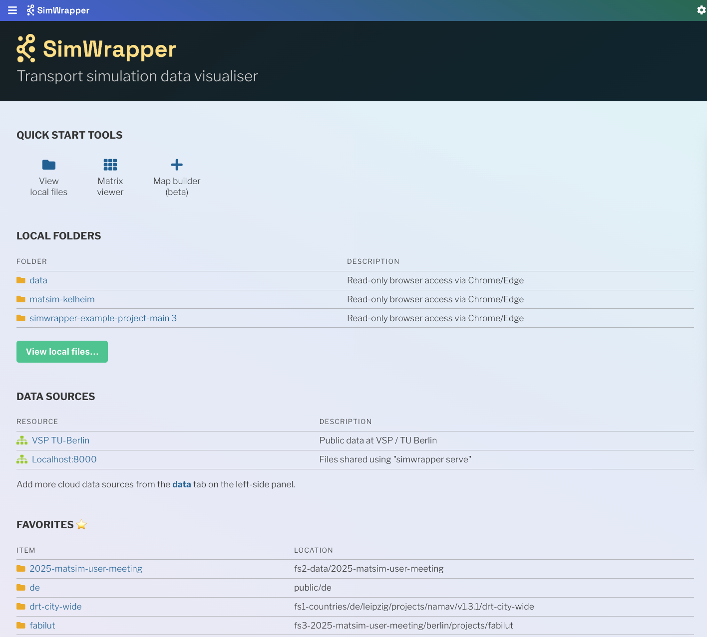

Announcing the release of SimWrapper 4.0, available now on GitHub and at **https://simwrapper.app**

There are lots of new things to share:

### New front page and file browser

The front page and file browser are much cleaner and more refined with a less garish color scheme. In addition to looking nicer, it now should be easier to find your projects, favorites, and documentation.

### Experimental MATSim event file viewer

A first stab at a viewer for MATSim event files is now enabled. Currently this just shows vehicle trajectories found in the file, but a more feature-rich version is in the works.

Inside simwrapper.app you can browse to any folder containing an `output_events.xml.gz` file, and click on the "EVENTS-output.xml.gz" in the list of maps. The file should start streaming almost immediately.

### Matrix viewer for OMX/HDF5 files

The OMX/HDF5 matrix viewer allows you to explore your matrix data in tabular form -- or in combination with a zonal shapefile, you can visually inspect it one row or column at a time. (If you have ideas on how to visual the _entire_ matrix on a map instead of just one slice, let me know!)

The matrix viewer has been out for a while. This version sports a much-improved user interface and massively improved performance for non-local files. Other additions include a built-in compare/diff mode, table and zone filter/search capability,  and editable legend breakpoints.

### Updated python package for local installations

The old `pip install simwrapper` python app was back-burnered for a while, but it is back!

The new version is ideal for those of you who want to run SimWrapper inside your firewall instead of using the [simwrapper.app](https://simwrapper.app) website.

The new version learned a new command, `simwrapper flask` which starts a Python "flask" app and serves up files in the current folder from a local HTTP server. This is super useful if you have cloud-storage files mounted to a folder on a server, for example!

Contact me or [ask on the discussion board](https://github.com/orgs/simwrapper/discussions) for more details on how to use the new Python app.

### ...and more!

There are many, many bugfixes and small feature improvements in this release. All of us who have been working on this code or supporting the effort thank you for your interest in SimWrapper! Speaking of which...

There is a lot of interest in SimWrapper this year and the line keeps going up!

Let's see where 4.x takes us!

